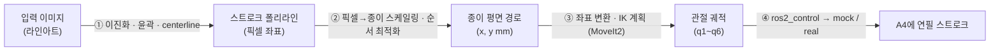

고양이가 세상을 지배한다

# Nyang_Nyang_Atlier 🐾

> **고양이 이미지 한 장을 넣으면, 로봇암이 A4 종이에 연필로 선화를 그린다.**
> 로봇이 그리고, AI가 채점한다.


---

## 프로젝트 개요

6-DoF 협동로봇암이 **정리된 고양이 이미지를 받아 사람 개입 없이 A4 종이에 연필 선화를 완성**하는 시스템입니다.
전시회·캣카페에서 방문객의 반려묘 사진을 즉석 선화로 그려주는 시나리오를 목표로 합니다.

**가치 방어선** — 경쟁재는 "AI 그림 + 프린터"(더 빠르고 예쁨). 이 프로젝트의 차별점은 두 가지입니다.

1. **로봇이 그리는 광경** — 15분의 공연, 관람 자체가 상품
2. **진짜 연필로 그린 실물 원본** — 물성이 있는 개인화 굿즈

기술 우선순위는 이 방어선을 기준으로 판단합니다. (예: 작화 속도 단축보다 작화 과정의 볼거리 우선)

---

## 현재 상태

| 단계 | 상태 |
| --- | --- |
| 요구사항·설계 (BRD · System Architecture · Process Flow) | ✅ 확정 (2026-07-21) |
| 구현 — **MVP: sim First Stroke** | 🚧 진행 중 |
| 실물 First Stroke | ⏸ R1 해소 대기 |

**MVP 정의**: MoveIt2 mock hardware + RViz2 환경에서 고양이 선화를 완주한다.
코어는 `① 이미지 처리 · ② 스트로크 계획 · ③ 로봇 제어 · ④ 드로잉 실행` (+ 긴급정지 최소) — 그림이 나오는 순방향 경로.
모니터링 · 캘리브레이션 · 검증환경 다단계는 그 위에 얹습니다.

> **핵심 리스크 R1** — HCR-5의 외부 연속궤적 인터페이스가 미확인 상태입니다(티칭펜던트 제어는 성공, 개발 PC 스크립트 제어 미성공). 이는 **실물 실행만 막을 뿐**, MoveIt2 mock hardware 경로로 소프트웨어 파이프라인 개발·검증은 선행 가능합니다.

---

## 파이프라인

이미지 한 장이 로봇 관절값이 되기까지:



**하드웨어 추상화 경계**를 두어 같은 제어 코드가 시뮬레이션(MuJoCo · IsaacSim)과 실물에서 동일하게 동작합니다.

---

## 기술 스택

| 계층 | 기술 |
| --- | --- |
| OS · 미들웨어 | Ubuntu 24.04 LTS · ROS 2 Jazzy |
| 언어 | C++ (제품 코드 전 구간) · Python (검증 도구) |
| 이미지 처리 | OpenCV 4.6 (+`ximgproc` thinning) |
| 로봇 제어 | **MoveIt 2** (Jazzy) + `ros2_control` |
| 드로잉 실행 | `joint_trajectory_controller` |
| 캘리브레이션 | eye-to-hand (ChArUco) · `realsense-ros` |
| 품질 판정 | CLIP zero-shot 분류 |
| 웹 | React + roslibjs · FastAPI · rosbridge_suite |
| DB | SQLite |
| 검증 환경 | MuJoCo → IsaacSim 5.1 (선택) → 실물 |

---

## 하드웨어

| 구성 | 사양 |
| --- | --- |
| 로봇암 | **Hanwha Techwin HCR-5** — 6-DoF 협동로봇, reach 915mm / payload 5kg / 반복정밀도 ±0.1mm |
| 엔드이펙터 | 스프링 내장 펜홀더 (자체 설계 · 3D 프린팅) — 플랜지 직결, 그리퍼 미사용 |
| 카메라 | Intel RealSense D455 (eye-to-hand, 외부 기둥 고정) |
| 작업대 | 철제 책상 상판 수평 고정 · A4 종이 지그(자체 제작) |

---

## 수락 기준

| ID | 기준 | 검증 방법 |
| --- | --- | --- |
| **AC1** | E2E 자동 완주 | 이미지 입력 → 사람 개입 없이 A4 선화 완성 (종이가 지그에 놓인 상태에서 시작) |
| **AC2** | 경로 최적화 효과 | 무최적화 대비 총 이동시간 **20% 이상 단축** — 로그 기반 측정 |
| **AC3** | "고양이로 인식됨" | 결과물 촬영 → CLIP zero-shot `{cat, dog, rabbit, bird, horse}` 중 **cat 1위** |

성능 목표: 스트로크 300~500개 기준 **1장 15분 이내**.

---

## 로드맵

| Phase | 내용 | 성격 |
| --- | --- | --- |
| **1** | 라인아트 입력 → 실물 선화 검증 | 학습 · 기술 검증 (**현재**) |
| 2 | 사진→엣지 파이프라인 + 연속 운전 안정화 → 전시회 시연 | 유인 운영 |
| 3 | 저가 협동암 이전 + 무인 운영 + 안전 설계 → 캣카페 상설 도입 | 사업화 |

---

## 저장소 구성

현재는 README만 공개되어 있습니다. 설계 문서(BRD · System Architecture · Process Flow), 다이어그램, 구현 코드는 정리되는 대로 순차 반영합니다.

```
Nyang_Nyang_Atlier/
├── README.md          ← 현재 공개
├── docs/              (예정) 요구사항·설계 문서
├── diagrams/          (예정) 시스템 구조도 · 프로세스 흐름도
└── src/               (예정) ROS 2 패키지 · MoveIt2 실행 환경
```

---

## 프로젝트 목표

작품 품질과 별개로, 아래를 프로젝트 자체의 달성 기준으로 둡니다.

- **G1** C++ 실전 학습 — 제품 코드 전 구간 C++ 구현
- **G2** MoveIt2 실전 활용 역량 — 드로잉 실행이 MoveIt2 기반으로 동작함을 시연
- **G3** 포트폴리오 결과물 확보 — 그림 · 시연 영상 · 코드 · 문서
- **G4** 요구사항 기반 개발 실천 — BRD → 설계 → 구현 → 수락 검증 전 주기 산출물

---

<sub>Phase 1은 포트폴리오 / 학습용 개인 프로젝트입니다.</sub>
