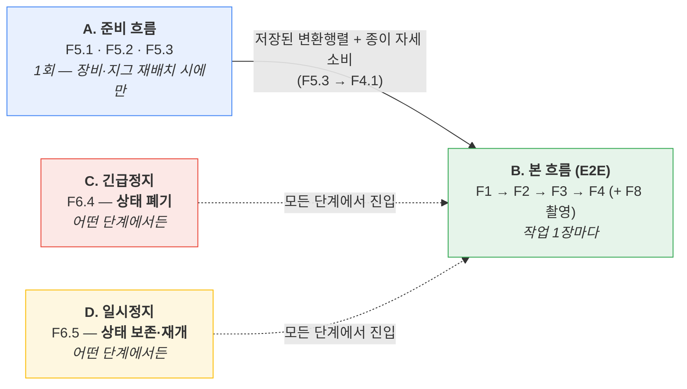
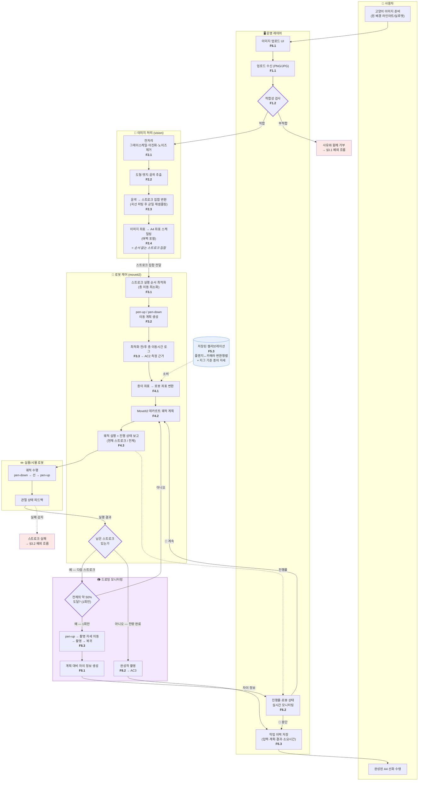
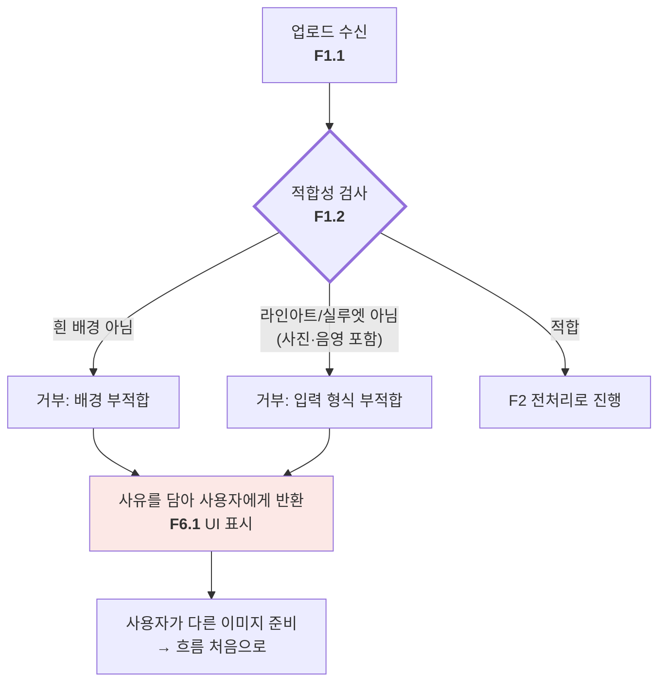
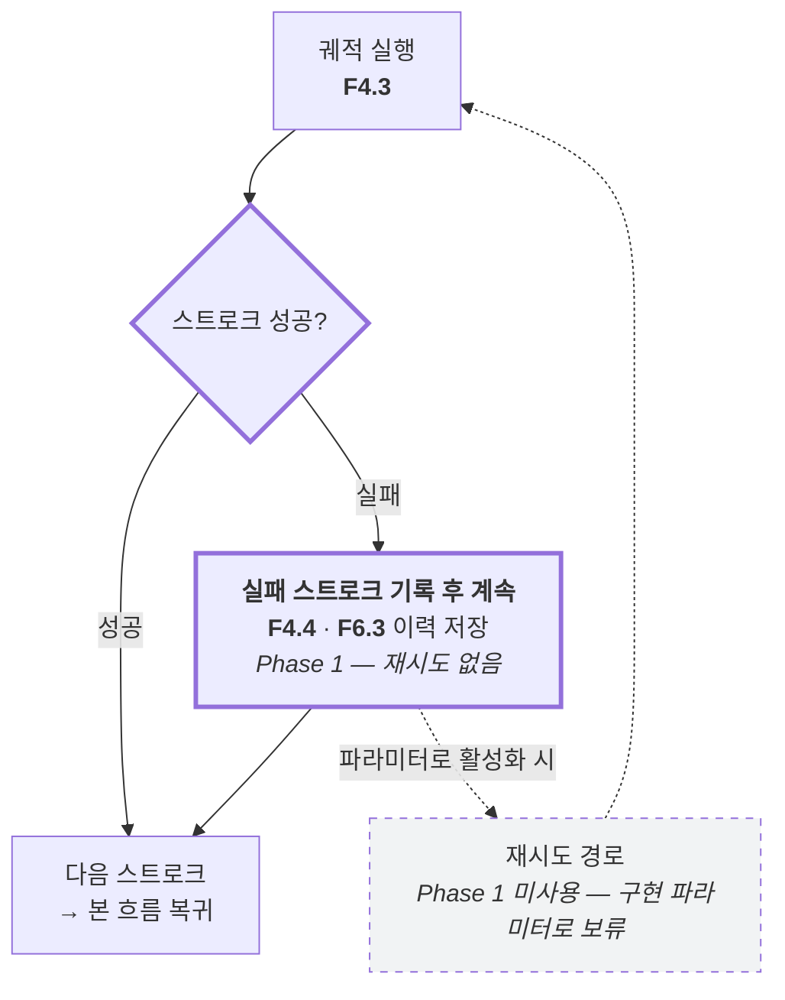
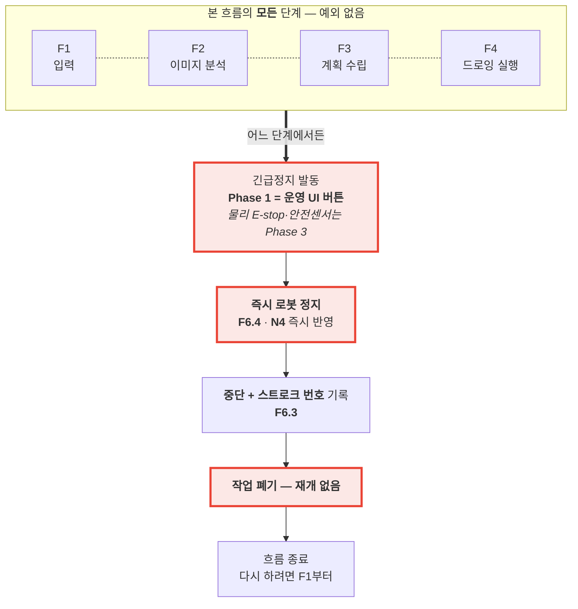
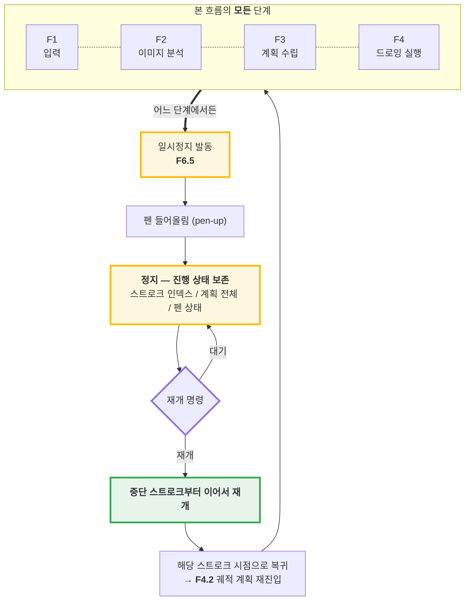
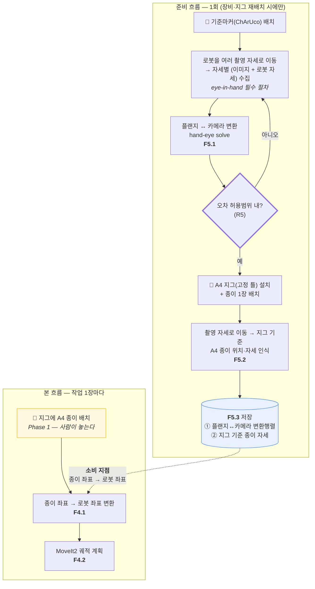
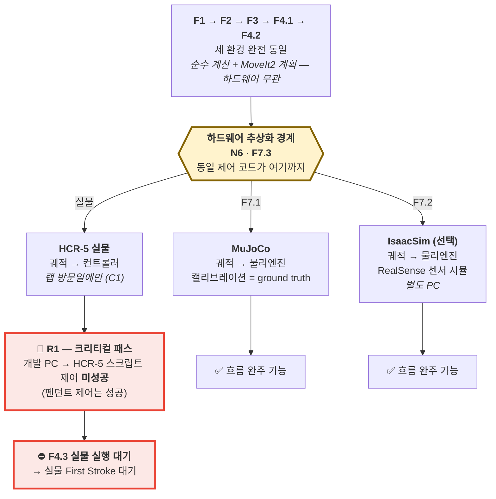

# Nyang_Nyang_Atlier — 프로세스 흐름 (Process Flow)

| 항목 | 내용
| ---- | -----------------------------------------------------------
| 프로젝트 | Nyang_Nyang_Atlier — 고양이 소묘화 로봇화가 운영 시스템
| 문서 | 프로세스 흐름 — 이미지 입력부터 종이 위 실물 선까지, 시간 축 단면
| 기준 | `Business Requirements.md` (요구사항 ID) · `System Architecture.md` (기능 블록·레인)
| 상태 | 초안 (mermaid) — 상세 판단이력·`[확인필요]`는 `agent_Process_Flow.md`

> **표기**: `F2.3` = BRD 요구사항 ID / 굵은 테두리 = 판단 지점 / `코어`·`이후` = MVP 태그(SA와 동일).
> **답하는 질문**: 고양이 이미지 한 장이 들어와 종이 위 선이 되기까지, 무엇이 어떤 순서로 일어나는가.

---

## 1. 전체 지도 — 네 개의 흐름

서로 다른 주기로 도는 네 흐름으로 구성된다.

| 흐름 | 주기 | 성격 | MVP |
| --- | --- | --- | --- |
| **B. 본 흐름 (E2E)** | 작업 1장마다 | 이미지 → 계획 → 실행 (+ 중간 1회·완성작 촬영 F8) | **코어** (F8은 `이후`) |
| **A. 준비 흐름** | 1회 (재배치 시에만) | 캘리브레이션 저장·재사용 | 이후 |
| **C. 긴급정지** | 어떤 단계에서든 | 즉시 정지 → **폐기** | 코어(최소) |
| **D. 일시정지** | 어떤 단계에서든 | 즉시 정지 → **보존·재개** | 이후 |

- **준비 흐름 분리 근거**: F5.3이 캘리브레이션 결과 저장·재사용을 요구(매 작업 재캘리브레이션 불필요). 본 흐름에 넣으면 작업마다 기준마커 재배치 → F5.3·AC1 위반.
- **정지 둘의 대비**: 긴급정지(F6.4)와 일시정지(F6.5)는 둘 다 어떤 단계에서든 진입하나 **정반대로 종료** — 하나는 상태 폐기, 하나는 상태 보존·재개(§3.3·§3.4).

---

## 2. 정상 흐름 (E2E) `코어`

### 2.1 스윔레인

레인은 `System Architecture.md`의 기능 블록에 대응한다 — 운영(⑥ 작업관리·UI) / 이미지 처리(① 이미지처리·② 스트로크계획 = `src/vision`) / 로봇 제어(③ 로봇제어·④ 드로잉실행 = `src/moveit2`) / 드로잉 모니터링(⑤) / 로봇(HW·검증환경).

### 2.2 판단 지점

흐름이 갈라지는 곳은 네 곳.

| # | 판단 지점 | 근거 | 갈래 | 판단 기준
| - | --------- | ---- | ---- | --------
| 1 | 적합성 검사 | F1.2 | 적합 → F2 진행 / 부적합 → 거부 | 흰 배경 라인아트·실루엣 여부 (§3.1)
| 2 | 남은 스트로크 | F3.2 | 있음 → 루프 계속 / 없음 → 완성작 촬영 후 완료 | 계획된 스트로크 집합의 소진 여부
| 3 | 중간 촬영 시점 | F8.1 | 50% 도달 → 촬영 / 미달 → 루프 계속 | **작업당 1회만** 발동 (이후 재발동 없음)
| 4 | 👤 계속/중단 | F8.1 | 계속 → 루프 복귀 / 중단 → 이력 저장 후 종료 | **사람이 운영 UI에서 판단** — 시스템은 차이 정보만 제공

- **모듈 경계 = F2와 F3 사이**: `vision`(F2)은 **순서 없는 스트로크 집합**까지 만들고, `moveit2`(F3·F4)가 그리는 순서와 pen-up/down을 정한다. 순서 최적화(F3.1)가 로봇의 실제 이동거리를 알아야 하는 일이라서다 (`src/vision/README.md` A 참조).
- **스트로크 루프 경계**: F4.2(궤적 계획) ↔ F4.3(실행)이 스트로크 1개 단위로 반복. 루프 밖 F4.1(좌표 변환)은 전체 집합에 1회만 적용(작업 중 종이 위치 불변). N2(300~500 스트로크 / 15분) = 스트로크당 약 1.8~3.0초.
- **중간 촬영은 루프 안이지만 1회뿐**: 판단 지점 3이 루프 내부에 있으나 발동은 작업당 1회다. 스트로크마다 촬영하면 N2를 넘긴다(300~500회 × 자세 이동). **촬영 자세 이동 시간도 N2 예산에 포함**해야 한다.

---

## 3. 예외 흐름

실패 시 행동이 곧 설계다.

### 3.1 부적합 이미지 (F1.2) `코어`

- BRD F1.2 = "1차 범위는 흰 배경 라인아트/실루엣. 부적합은 **사유와 함께** 거부." 거부 사유 반환은 요구사항, 판정 기준의 구체값은 구현 단계 정의 대상.
- **로봇 무동작 경로** — 부적합 판정은 F2 진입 전 종료 → 계획·제어·실물 레인 미관여. 잘못된 입력을 로봇 도달 전에 막는 가장 값싼 실패.

### 3.2 스트로크 실패 (F4.4) `코어`

- **Phase 1 = 기록 후 계속, 재시도 없음.** 근거: AC1(완주) 우선, 선 몇 개 결손은 AC3(CLIP `cat` 판정)을 무너뜨릴 가능성 낮음. 재시도 횟수는 구현 단계 파라미터.
- 실패는 **기록될 뿐 흐름을 멈추지 않는다** — 스트로크 실패로 사람을 부르면 AC1 위반. 흐름을 죽이는 것은 긴급정지(F6.4)뿐.

### 3.3 긴급정지 (F6.4) `코어(최소)`

F6.4 = "어떤 상태에서든 즉시 로봇 정지" → 특정 단계가 아니라 **모든 단계에 걸친 횡단 관심사**.

- **모든 단계에서 진입 가능** — 계획 수립 중(F3, 로봇 미동작)에도 정지 명령은 수용되며 결과는 "이 작업을 로봇에 내리지 않음". 즉 로봇 정지이자 흐름 자체의 중단.
- **정지 후 = 폐기, 재개 없음.** 이력(F6.3)에 남길 것은 "중단 + 스트로크 번호"뿐(사후 분석용). 폐기이므로 긴급정지는 상태를 보존할 의무가 없다 — 이 점이 F6.5와 갈라진다.

### 3.4 일시정지 (F6.5) `이후`

**F6.4와 F6.5의 차이 — 이것이 이 흐름의 전부다.**

| 항목 | F6.4 긴급정지 | F6.5 일시정지
| --- | --- | ---
| 진입 지점 | 모든 단계 | 모든 단계 (동일)
| 정지 자체 | 즉시 | 즉시
| **펜 처리** | **pen-up 없이 즉시 정지** (blob 무관, 폐기하므로) | **pen-up 후 정지** (재개 위해 종이 보존)
| **정지 후 상태** | **폐기** | **보존**
| **재개** | **없음** — F1부터 다시 | **있음** — 중단 스트로크부터
| 이력(F6.3) 요구 | 중단 + 스트로크 번호 | **진행 상태 전체 보유**
| 흐름의 끝 | 종료 | 본 흐름으로 복귀

- **상태 소유자 = 아키텍처 질문.** 일시정지는 "어디까지 그렸는가"(스트로크 인덱스·계획 집합·펜 상태)를 보존·재개하므로, 그 소유 모듈이 정해져야 한다(③ 로봇제어 / ⑥ 작업관리 경계).
- **재개 단위 = 스트로크.** 스트로크 N 중간에 멈추면 재개 시 N을 처음부터 다시 긋는다(중간 이음매 방지) → 보존 상태가 "펜 3차원 좌표"가 아니라 "스트로크 인덱스" 하나로 단순화.
- **pen-up 후 정지 근거.** 펜이 종이에 닿은 채 멈추면 심이 한 점에 눌려 점(blob)이 남고 재개해도 사라지지 않는다. 재개 가능한 상태로 멈추는 것이 F6.5의 요구. (테이프 고정이라 z방향 완충이 없어 이 위험은 더 크다 — BRD R2)

---

## 4. 준비 흐름 — 캘리브레이션 (F5) `이후`

### 4.1 다이어그램

- **지그가 F5.2를 본 흐름에서 들어냈다.** 고정 틀이 종이 위치를 반복 재현 → 종이 자세는 준비 단계에서 1회 인식·저장(F5.3), 이후 모든 작업이 재사용. **eye-in-hand로 바뀌어도 이 "1회" 결론은 유지된다** — 플랜지↔카메라 관계는 팔이 움직여도 불변이므로.
- ⚠️ **"본 흐름에서 카메라 무동작"은 폐기된 전제다.** 캘리브레이션 목적으로는 여전히 본 흐름에서 카메라를 쓰지 않지만, **F8(드로잉 모니터링)이 본 흐름 안에서 카메라를 쓴다** — 중간 1회 + 완성작 촬영, 각각 촬영 자세 이동을 수반(§2.1).
- **eye-in-hand가 준비 흐름에 추가한 것**: 촬영마다 로봇을 자세로 옮겨야 하고, 각 이미지를 **그 시점의 로봇 자세와 짝지어야** hand-eye를 풀 수 있다. 마커 검출 자체는 로봇 자세를 모르는 순수 계산 (`src/vision/README.md` B).
- **MVP 대체**: MVP는 캘리브레이션을 고정 변환(하드코딩)으로 대체 가능 → 이 준비 흐름은 이후 단계.

### 4.2 소비 지점

| 소비 지점 | 무엇을 소비하는가 | 없으면
| --- | --- | ---
| F4.1 | 플랜지↔카메라 변환행렬 + 지그 기준 종이 자세 | 종이 좌표를 로봇 좌표로 변환 불가
| F8.3 | 촬영 자세 (종이를 정면으로 보는 자세) | 중간·완성작 촬영 불가

- **지그 공차 = R5에 흡수.** 틀이 종이 위치를 재현한다는 가정의 실제 공차는 실물 검증 대상 → R5(eye-in-hand 캘리브레이션 오차)로 관리(신규 위험 없음).
- **eye-in-hand 고유 오차 경로**: 촬영 시점 로봇 자세가 변환식에 들어가므로 **관절 자세 오차가 캘리브레이션 오차로 전파**된다 — R5에 추가된 원인 항목.

---

## 5. 시뮬레이션 3단계 — 흐름은 어디서 갈라지는가

**F1~F4.2까지 세 환경이 완전히 동일, F4.3(궤적 실행)에서 갈라진다.** 그 지점이 곧 하드웨어 추상화 경계(N6/F7.3).

### 5.1 같은 것과 다른 것

| 구간 | MuJoCo | IsaacSim | 실물 | 비고
| --- | --- | --- | --- | ---
| F1 입력 | 동일 | 동일 | 동일 | 픽셀 처리 — 하드웨어 무관
| F2 이미지 분석 | 동일 | 동일 | 동일 | 순수 계산
| F3 계획 수립 | 동일 | 동일 | 동일 | 순수 계산
| F4.1 좌표 변환 | 동일 | 동일 | 동일 | 입력값(캘리브레이션 소스)만 다름
| F4.2 궤적 계획 | 동일 | 동일 | 동일 | MoveIt2 — URDF만 교체
| **F4.3 실행** | **분기** | **분기** | **분기** | **여기가 경계다**
| F5 캘리브레이션 | 불필요 | 센서 시뮬 | 필수 | 시뮬은 변환행렬이 이미 참값
| **F8 촬영·모니터링** | **불가** (카메라 없음) | 센서 시뮬 | 필수 | MuJoCo에서는 F8을 끄고 완주 — AC1 검증에는 영향 없음
| F6.4 긴급정지 | 시뮬 정지 | 시뮬 정지 | 실물 정지 | 흐름 구조는 동일

- **흐름의 대부분이 하드웨어와 무관** — F1~F4.2(이미지 수신부터 궤적 계획까지)는 세 환경에서 같은 코드. 갈라지는 것은 "계획된 궤적을 어디로 보내는가" 한 곳. C1(랩 왕복·주 2회) 제약 아래 sim 선행 개발이 성립하는 근거.
- **R1이 그 갈라지는 지점에 위치.** 시뮬 두 갈래는 완주 가능(초록), 실물 갈래만 대기(빨강)가 현재 상태. **MoveIt2 mock hardware로 sim First Stroke는 R1 무관하게 달성 가능**(SA §5.3).

---

## 6. AC1 — 사람 개입 지점 검토 `코어`

| 지점 | 사람이 하는 일 | AC1 위반?
| --- | --- | ---
| 이미지 업로드 (F1.1) | 이미지를 올린다 | 아니다 — AC1의 출발선
| 기준마커·A4 지그 설치 | 준비 흐름 (1회) | 아니다 — F5.3이 재사용 보장
| 지그에 종이 배치 | 종이를 틀에 놓는다 | 아니다 — 아래 해석 확정
| **중간 계속/중단 판단 (F8.1)** | 차이 정보를 보고 계속할지 정한다 | ⚠️ **작화 도중의 개입 — 아래 참조**
| 결과물 수령 | 그림을 가져간다 | 아니다 — AC1의 결승선 밖

- **AC1 해석 확정**: Phase 1에서 A4 종이는 사람이 틀에 놓는다. AC1의 "사람 개입 없이"는 **"종이가 틀에 놓인 상태에서 시작해 선화 완성까지"**로 읽는다.
- **근거**: BRD §1.2가 무인 연속 운전(종이 교체 포함)을 Phase 3 사업화 전제로 명시 → 역으로 Phase 1은 사람 배치를 전제(BRD 자체에서 도출).

> **F8.1의 사람 판단은 AC1과 어떻게 양립하는가 — 미확정**
>
> 앞의 네 지점은 모두 작화 **바깥**(출발선 전 / 준비 / 결승선 밖)이라 AC1을 건드리지 않았다. 그런데 F8.1의 계속/중단 판단은 **작화 도중**에 놓인 최초의 개입 지점이다. AC1("종이가 놓인 뒤부터 완성까지 사람이 손대면 불합격")과 정면으로 만난다.
>
> 가능한 해석 두 갈래 — **아직 정하지 않았다.**
> 1. **비개입으로 본다** — 무응답 시 자동 "계속"이 기본값. 사람의 개입은 *중단시킬 때만* 일어나므로, AC1 완주 판정에는 영향 없다(중단하면 애초에 완주 실패로 기록됨).
> 2. **개입으로 본다** — 그렇다면 AC1 측정 시에는 F8.1을 끄고 완주시키고, F8.1은 운영 편의 기능으로 분리한다.
>
> 1번이 자연스러워 보이나 **BRD AC1 문구 조정이 필요할 수 있어 별도 확정 대상으로 남긴다.**

---

## 부록 A. BRD 요구사항 ↔ 흐름 매핑

F1~F8 전부가 흐름에 등장 — 누락 없음.

| BRD | 요구사항 | 본 문서 위치 | 레인
| --- | --- | --- | ---
| F1.1 | 이미지 업로드 수신 | §2.1 | 운영
| F1.2 | 입력 적합성 검사·거부 | §2.1 판단①, §3.1 | 운영
| F2.1 | 전처리 | §2.1 | 이미지 처리
| F2.2 | 도형·엣지·윤곽 추출 | §2.1 | 이미지 처리
| F2.3 | 윤곽 → 스트로크 변환 | §2.1 | 이미지 처리
| F2.4 | 이미지 → A4 좌표 스케일링 | §2.1 | 이미지 처리
| F3.1 | 스트로크 순서 최적화 | §2.1 | **로봇 제어** (이관됨 — §2.2)
| F3.2 | pen-up/down 이동 계획 | §2.1 | **로봇 제어** (이관됨 — §2.2)
| F3.3 | 최적화 전/후 로그 (AC2 근거) | §2.1 | **로봇 제어** (이관됨 — §2.2)
| F4.1 | 종이 → 로봇 좌표 변환 | §2.1, §4.2 | 로봇 제어
| F4.2 | MoveIt2 데카르트 궤적 계획 | §2.1 (루프) | 로봇 제어
| F4.3 | 궤적 실행·진행 보고 | §2.1, §5 분기점 | 로봇 제어
| F4.4 | 실패 스트로크 처리 | §3.2 (기록 후 계속) | 로봇 제어
| F5.1 | **eye-in-hand** 캘리브레이션 | §4.1 준비 | 준비
| F5.2 | A4 종이 위치·자세 인식 | §4.1 준비 (지그 확정) | 준비
| F5.3 | 캘리브레이션 저장·재사용 | §4.1 준비 + §4.2 소비 | 준비
| F6.1 | 이미지 업로드 UI | §2.1, §3.1 | 운영
| F6.2 | 진행률·상태 모니터링 | §2.1 | 운영
| F6.3 | 작업 이력 관리 | §2.1, §3.2, §3.3, §3.4 | 운영
| F6.4 | 긴급정지 — 상태 폐기 | §3.3 (횡단) | 전 레인
| F6.5 | 일시정지 — 상태 보존·재개 | §3.4 (횡단) | 전 레인
| F7.1 | MuJoCo 전체 파이프라인 | §5 분기 | 실물/시뮬
| F7.2 | IsaacSim 전체 파이프라인 (선택) | §5 분기 | 실물/시뮬
| F7.3 | sim/real 스위칭 | §5 경계 | 실물/시뮬
| F8.1 | 중간 모니터링 (1회, 50% 지점) | §2.1 판단③④ | 드로잉 모니터링
| F8.2 | 완성작 촬영 | §2.1 | 드로잉 모니터링
| F8.3 | 촬영 자세 이동 | §2.1, §4.2 소비 | 드로잉 모니터링

**수락 기준 연결**

| AC | 기준 | 본 문서에서
| --- | --- | ---
| AC1 | E2E 자동 완주 | §6 — 종이 배치 전제 명시. **F8.1 중간 판단(사람)이 새 개입 지점** → §6 참조
| AC2 | 최적화 20% 단축 | F3.3 로그가 측정 근거 (§2.1)
| AC3 | CLIP cat 1위 | 판정은 흐름 밖. 단 **입력 사진은 F8.2(완성작 촬영)가 흐름 안에서 만든다**
