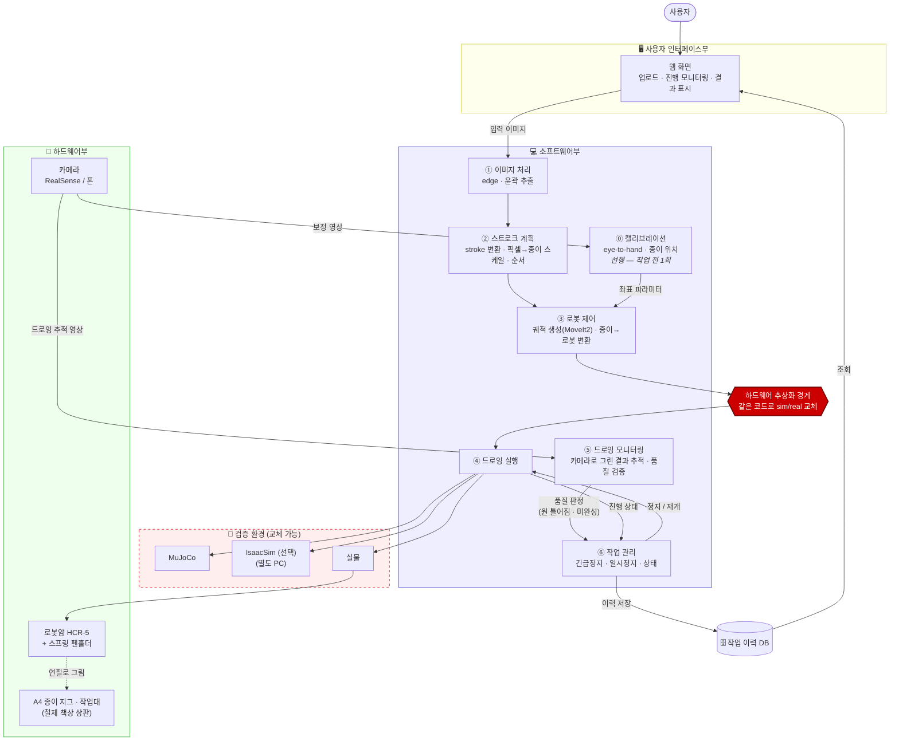
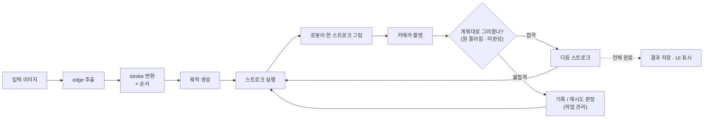
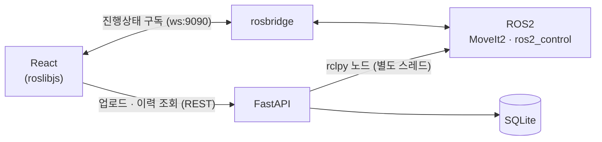

# Nyang_Nyang_Atlier — 시스템 구조 (System Architecture)

| 항목 | 내용
| ---- | -----------------------------------------------------------
| 프로젝트 | Nyang_Nyang_Atlier — 고양이 소묘화 로봇화가 운영 시스템
| 문서 | 시스템 구조도 — 하드웨어 · 소프트웨어 · 인터페이스 · DB · 검증 환경
| 상태 | 초안 (mermaid) — drawio 변환은 추후. 모듈 상세 설계는 `Software Design.md`

> 시스템이 무엇으로 이루어지는지 한눈에 보는 문서. 세부 모듈·인터페이스는 소프트웨어 상세 설계에 별도.

---

## 1. 시스템 구성 (한눈에)

| 부 | 구성 | 역할
| --- | --------------------------------- | -----------------------------------------------
| 🖥 **사용자 인터페이스부** | 웹 화면 | 이미지 업로드(입력) · 진행 모니터링 · 결과 표시(출력)
| 💻 **소프트웨어부** | 7개 기능 블록 | (선행) 캘리브레이션 → 이미지→스트로크→제어→실행→모니터링, + 작업관리(상시)
| 🔧 **하드웨어부** | 로봇암 · 카메라 · 종이 지그 | 실제로 A4에 연필로 그림
| 🗄 **데이터(DB)** | 작업 이력 | 입력·계획·결과·품질 판정 저장
| 🧪 **검증 환경** | MuJoCo · IsaacSim(선택) · 실물 | 같은 SW로 교체 검증 (하드웨어 추상화)

> **MVP 범위 (최소기능구현)**: 로봇이 **sim(MoveIt2 mock)** 에서 고양이 선화를 그린다. **코어 = 이미지처리① · 계획② · 제어③ · 실행④ (+ ⑥ 긴급정지 최소)** (그림이 나오는 순방향 경로). **이후 = 캘리브레이션⓪(선행 준비) · 모니터링⑤ · ⑥ 일시정지·상태 · 검증환경 다단계** — 코어 위에 얹는다.

---

## 2. 전체 구조도

---

## 3. 핵심 데이터 흐름

### 3.1 계산 파이프라인 (데이터 변환)

**이미지 한 장이 로봇 관절값이 되기까지** — 기능 블록이 데이터를 한 단계씩 변환한다 (MVP 순방향 경로).

```mermaid
flowchart LR
    A["입력 이미지<br/>(RGB/그레이)"]
    B["스트로크 폴리라인<br/>(픽셀 좌표)"]
    C["종이 평면 스트로크<br/>(x,y mm)"]
    D["순서 있는 종이 경로<br/>(x,y mm)"]
    E["로봇 작업공간 경로<br/>(x,y,z · base frame)"]
    F["관절 궤적<br/>(q1~q6 시퀀스)"]
    G["A4에 연필 스트로크"]
    A -->|"① 이미지 처리<br/>이진화·윤곽·centerline"| B
    B -->|"② 픽셀→종이 mm 스케일링<br/>(F2.4)"| C
    C -->|"② 그리는 순서 최적화<br/>(F3.1)"| D
    D -->|"③ 좌표 변환<br/>종이→로봇 (F4.1, 캘리브레이션)"| E
    E -->|"③ 궤적·IK 계획<br/>(F4.2, MoveIt2)"| F
    F -->|"④ 드로잉 실행<br/>ros2_control → mock/real"| G
```

- **핵심 계산 블록**: 픽셀을 종이(mm)로 스케일링(② F2.4)한 뒤, 종이를 로봇 좌표로 변환(③ F4.1)하고 MoveIt2가 관절값(q)을 푼다. **이미지가 "로봇이 움직일 목표값"이 되는 지점.**
- MVP는 이 순방향 경로만으로 **sim(RViz)에서 그림이 나온다.** 아래 3.2는 그 위에 얹는 품질 피드백.

### 3.2 그리기–검증 루프 (품질 피드백)

**⑤ 드로잉 모니터링**이 이 시스템의 새 축이다 — 로봇이 그린 실제 결과를 카메라로 되짚어 품질을 확인한다.

- 스트로크 단위로 **실행 → 촬영 → 검증 → 다음** 을 돈다.
- 불합격(고양이 얼굴 원이 틀어짐·미완성)이면 **작업 관리(⑥)**가 기록·재시도를 판정한다.

---

## 4. 구성 블록 설명

**🔧 하드웨어부** — 주요 구성요소

| 구성 | 구성요소 | MVP |
| --- | --- | --- |
| **로봇암 HCR-5** | 6× 관절(서보모터 + 엔코더) · 링크 · 툴 플랜지 · 전용 컨트롤러 + 티치펜던트 | 코어 |
| **엔드이펙터** | 스프링 펜홀더 + 연필 (그리퍼 없음, 플랜지 직결) | 코어 |
| **작업대** | 철제 책상 상판(수평 고정) · A4 종이 지그(고정 틀) · A4 용지 | 코어 |
| **비전** | 카메라(RealSense — **모델 미정** / 폰) · 거치대 · ArUco 기준마커 | 이후 |

- 로봇암·엔드이펙터·작업대 = **MVP 코어** (그림이 나오려면 필수). 비전은 ⓪ 캘리브레이션·⑤ 모니터링용 → **MVP 이후** 얹음(MVP는 고정 좌표 변환으로 대체).

**💻 소프트웨어부** (기능 블록 · MVP 태그)

**⓪ 선행 — 준비 흐름** (작업 전 1회, 장비·지그 재배치 시에만 / `Process Flow.md` §4)
- **⓪ 캘리브레이션** `이후` — eye-to-hand(카메라↔로봇, F5.1) + 지그 기준 종이 위치·자세(F5.2). **결과를 저장(F5.3)해 이후 모든 작업이 재사용** → ③의 좌표 변환(F4.1)이 이 값을 소비한다. 그림을 그리기 전에 끝나 있어야 하며, 작업마다 반복하지 않는다. MVP는 고정 변환(하드코딩)으로 대체

**본 작업 흐름** (이미지 1장당 1회 · ①→②→③→④ 순방향)
- **① 이미지 처리** `코어` — 입력 그림 → 이진화·윤곽·centerline → 스트로크 폴리라인(픽셀)
- **② 스트로크 계획** `코어` — 스트로크 변환 + **픽셀→종이 mm 스케일링(F2.4)** + **그리는 순서**(F3.1)
- **③ 로봇 제어** `코어` — **좌표 변환**(종이 mm→로봇, F4.1 ← ⓪ 소비) + 궤적·IK 생성(F4.2, MoveIt2). ← 핵심 계산 블록(§3.1)
- **④ 드로잉 실행** `코어` — 관절 궤적을 로봇(mock/real)에 실행
- **⑤ 드로잉 모니터링** `이후` — ④와 스트로크 단위로 맞물려 그려진 결과 추적 → 품질 검증(§3.2)

**상시**
- **⑥ 작업 관리** — **긴급정지(F6.4) `코어(최소)`** / 일시정지(F6.5)·진행 상태 `이후`. 전 구간에서 동작

> 번호는 **기능 블록 ID**다. ⓪만 본 흐름 밖의 선행 단계이고, ①~⑤는 본 흐름의 진행 순서와 일치한다. 시간 축 상세는 `Process Flow.md`.

**🖥 사용자 인터페이스부**
- **웹 화면** — 이미지 업로드(입력) · 진행률·로봇 상태 모니터링 · 결과 이미지 표시(출력)

**🗄 데이터(DB)**
- **작업 이력** — 입력 이미지 · 계획 · 실행 결과 · 품질 판정 · 소요시간

**🧪 검증 환경**
- **MuJoCo → IsaacSim(선택) → 실물**. **하드웨어 추상화 경계**로 같은 SW가 교체 대상만 바꿔가며 검증

---

## 5. 기술 스택 (ROS2 Jazzy / Ubuntu 24.04 — 지원 상태 검증 완료)

### 5.1 계층별 스택

| 계층 / 블록 | 기술 | 상태 | 비고
| ----------- | ---- | ---- | -----------------------------------------
| OS | Ubuntu 24.04.4 LTS (커널 6.8) | 확정 |
| 미들웨어 | ROS2 Jazzy (rmw-cyclonedds 권장) | 확정 |
| 언어 | C++ (제품) / Python (도구·프로토타입) | 확정 |
| ⓪ 캘리브레이션 `선행` | `realsense-ros` + hand-eye (easy_handeye2 등) | ✅ / 부분 | moveit_calibration Jazzy 바이너리 없음
| ① 이미지 처리 | OpenCV 4.6 (+contrib `ximgproc`) | ✅ 표준 | Otsu 이진화 → findContours → approxPolyDP
| ② 스트로크 계획 | 자체 C++ (순서 최적화) | — |
| ③ 로봇 제어 | **MoveIt2** (Jazzy) + ros2_control | ✅ 정식 | URDF + SRDF (Setup Assistant)
| ④ 드로잉 실행 | ros2_control `joint_trajectory_controller` | ✅ |
| ⑤ 드로잉 모니터링 | OpenCV (ORB+Homography 정합 / SSIM·absdiff 차이) | ✅ | ArUco 기준마커 권장
| ⑥ 작업 관리 `상시` | 자체 C++ (진행 상태 소유) | — |
| 카메라 | RealSense (`realsense-ros` / librealsense) | ✅ 정식 | **모델 미정** — 1순위 D455 / 대안 폰, F5에서 확정(BRD §4). **DKMS 금지** — ROS apt 설치. 검증 버전 4.56 / 2.56은 D455 기준
| AC3 분류 | CLIP (HuggingFace transformers zero-shot) | ✅ | 도메인 프롬프트 + 음성 라벨
| 웹 프론트 | **React** + roslibjs | ✅ |
| 웹 백엔드 | **FastAPI** (REST) + rclpy 노드(별도 스레드 spin) | 표준 조합 |
| 실시간 브릿지 | **rosbridge_suite** (websocket :9090) | ✅ 정식 | 토픽·서비스 O / 액션 X
| DB | **SQLite** (+ SQLAlchemy ORM) | 확정 | 이미지는 파일시스템, DB엔 경로·메타

### 5.2 웹 ↔ ROS2 연동 (검증 반영)

- 업로드 · DB · 이력 조회 → **FastAPI (REST)**
- 실시간 진행상태 · 텔레메트리 → **rosbridge → React 구독**
- **MoveIt2 제어는 웹에서 직접 호출하지 않음** — rosbridge 액션이 불안정 → 서버측(rclpy/C++ 노드)이 MoveIt 구동, 웹은 상태만 구독

### 5.3 검증에서 잡힌 통합 리스크 · 기회

**리스크 (미리 알 것)**
- **RealSense DKMS ✗** — 커널 6.8에서 dkms 빌드 실패. `ros-jazzy-librealsense2*`(ROS apt) 또는 RSUSB 백엔드로. Intel → **realsenseai.com** 도메인 이동(구 URL·키 실패)
- **rosbridge 액션 불안정** — MoveIt 제어는 서버측, 웹은 텔레메트리만 (5.2)
- **OpenCV 라인 추출** — Canny는 선의 **이중 윤곽**을 냄 → centerline은 `ximgproc.thinning`. 라인아트는 특징점이 적어 정합 시 **ArUco 기준마커** 권장
- **CLIP 스케치 도메인 정확도 하락** — 연필선화 프롬프트 튜닝 + cat 판정 신뢰도 **실측 검증** 필요
- **moveit_calibration Jazzy 바이너리 없음** — 커뮤니티 대안(easy_handeye2 등)

**기회 (일정에 유리)**
- 🟢 **MoveIt2 mock hardware** — **URDF만 있으면 실기(R1) 없이** 궤적 계획→실행→RViz 전 경로를 검증할 수 있다. **R1(외부 제어) 해결을 기다리는 동안에도 SW 개발·검증을 진행**할 수 있다 — 크리티컬 패스 병목을 우회하는 큰 이점.

---

## 6. 설계 메모 · 미확정

- **카메라 이중 역할** — 캘리브레이션 + 드로잉 모니터링. 뎁스 유무(RealSense vs 폰)가 종이 높이(z)·추적 정밀도에 영향
- **⑤ 드로잉 모니터링은 BRD 넘어선 신규 요구** — BRD F4.3(진행 보고)·F4.4(기록 후 계속)까지였다. "카메라 품질 검증"은 그 이상 → **BRD 역반영 + Phase 1 재시도 정책** 확정 필요
- **HCR-5 실기 ros2_control 드라이버** — 여전히 미확인(R1). 단 위 mock 경로로 개발은 선행 가능
- **MVP 우선 · 과분해 안 함** — 기능 블록 단위로 충분. 코어(①②③④ + ⑥ 긴급정지 최소)로 **sim First Stroke** 달성 후 ⓪⑤·⑥ 일시정지·검증 다단계를 얹는다
- **drawio 변환** — mermaid 텍스트 그대로 옮김. PC 여유 시
