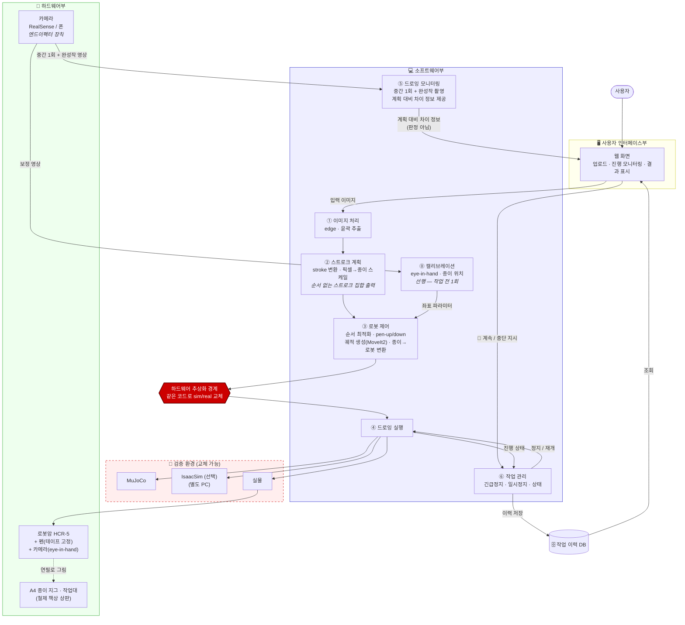
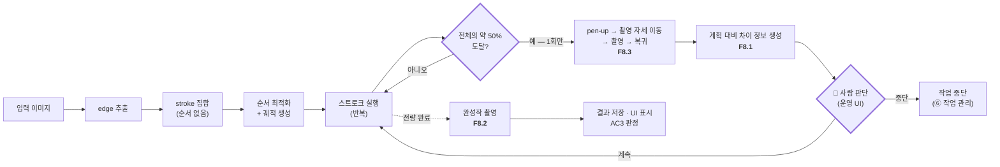
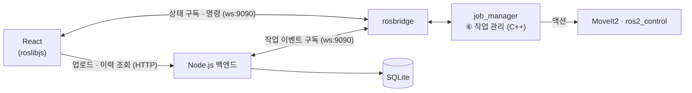

# Nyang_Nyang_Atlier — 시스템 구조 (System Architecture)

| 항목 | 내용
| ---- | -----------------------------------------------------------
| 프로젝트 | Nyang_Nyang_Atlier — 고양이 소묘화 로봇화가 운영 시스템
| 문서 | 시스템 구조도 — 하드웨어 · 소프트웨어 · 인터페이스 · DB · 검증 환경
| 상태 | 초안 (mermaid) — drawio 변환은 추후. 모듈 상세 설계는 `Software Design.md`

> 시스템이 무엇으로 이루어지는지 한눈에 보는 문서. 세부 모듈·인터페이스는 소프트웨어 상세 설계에 별도.

---

## 1. 시스템 구성 (한눈에)

| 부 | 구성 | 역할
| --- | --------------------------------- | -----------------------------------------------
| 🖥 **사용자 인터페이스부** | 웹 화면 | 이미지 업로드(입력) · 진행 모니터링 · 결과 표시(출력)
| 💻 **소프트웨어부** | 7개 기능 블록 | (선행) 캘리브레이션 → 이미지→스트로크→제어→실행→모니터링, + 작업관리(상시)
| 🔧 **하드웨어부** | 로봇암 · 카메라 · 종이 지그 | 실제로 A4에 연필로 그림
| 🗄 **데이터(DB)** | 작업 이력 | 입력·계획·결과·품질 판정 저장
| 🧪 **검증 환경** | MuJoCo · IsaacSim(선택) · 실물 | 같은 SW로 교체 검증 (하드웨어 추상화)

> **MVP 범위 (최소기능구현)**: 로봇이 **sim(MoveIt2 mock)** 에서 고양이 선화를 그린다. **코어 = 이미지처리① · 계획② · 제어③ · 실행④ (+ ⑥ 긴급정지 최소)** (그림이 나오는 순방향 경로). **이후 = 캘리브레이션⓪(선행 준비) · 모니터링⑤ · ⑥ 일시정지·상태 · 검증환경 다단계** — 코어 위에 얹는다.

---

## 2. 전체 구조도

---

## 3. 핵심 데이터 흐름

### 3.1 계산 파이프라인 (데이터 변환)

**이미지 한 장이 로봇 관절값이 되기까지** — 기능 블록이 데이터를 한 단계씩 변환한다 (MVP 순방향 경로).

```mermaid
flowchart LR
    A["입력 이미지<br/>(RGB/그레이)"]
    B["스트로크 폴리라인<br/>(픽셀 좌표)"]
    C["종이 평면 스트로크 집합<br/>(x,y mm · <b>순서 없음</b>)"]
    D["순서 있는 종이 경로<br/>(x,y mm · pen-up/down 포함)"]
    E["로봇 작업공간 경로<br/>(x,y,z · base frame)"]
    F["관절 궤적<br/>(q1~q6 시퀀스)"]
    G["A4에 연필 스트로크"]
    A -->|"① 이미지 처리<br/>이진화·윤곽·centerline"| B
    B -->|"② 픽셀→종이 mm 스케일링<br/>(F2.4)"| C
    C -->|"③ 그리는 순서 최적화 · pen-up/down<br/>(F3.1, F3.2)"| D
    D -->|"③ 좌표 변환<br/>종이→로봇 (F4.1, 캘리브레이션)"| E
    E -->|"③ 궤적·IK 계획<br/>(F4.2, MoveIt2)"| F
    F -->|"④ 드로잉 실행<br/>ros2_control → mock/real"| G
```

- **핵심 계산 블록**: 픽셀을 종이(mm)로 스케일링(② F2.4)한 뒤, ③이 **그리는 순서와 pen-up/down을 정하고**(F3.1·F3.2) 종이를 로봇 좌표로 변환(F4.1)하면 MoveIt2가 관절값(q)을 푼다. **이미지가 "로봇이 움직일 목표값"이 되는 지점.**
- **②와 ③의 경계** — ②는 **순서 없는 스트로크 집합**까지만 만든다. 순서 최적화(F3.1)는 로봇의 실제 이동거리를 알아야 하는 일이고, 순서가 정해지지 않으면 pen-up 구간(어디서 들어 어디로 갈지)도 정할 수 없어 F3.2도 ③에 붙는다. 모듈 대응은 ② = `src/vision`, ③ = `src/moveit2`
- MVP는 이 순방향 경로만으로 **sim(RViz)에서 그림이 나온다.** 아래 3.2는 그 위에 얹는 품질 피드백.

### 3.2 그리기–검증 (품질 피드백) — **루프 아님, 1회 개입**

**⑤ 드로잉 모니터링**이 이 시스템의 새 축이다 — 로봇이 그린 실제 결과를 카메라로 되짚어 품질을 확인한다. **단 스트로크 단위 루프가 아니라 작화 중 1회 + 완료 시 1회다** (F8).

- **스트로크마다 촬영하지 않는다** — 스트로크가 300~500개이므로 매번 촬영·검증하면 N2(15분 이내)를 넘긴다. 중간 확인의 목적은 "이 작업을 계속할 가치가 있는가" 판단이므로 1회로 족하다.
- **판정 주체는 사람** — 시스템은 계획 대비 차이 정보만 만들고, 계속/중단은 운영 UI에서 사람이 정한다. Phase 1이 "랩에서 사람이 지켜보는 환경"(BRD F6.4)이라는 전제와 일치.
- **촬영에는 자세 이동이 따라온다** — 펜과 카메라가 같은 플랜지에 있어 작화 자세에서는 종이를 정면으로 볼 수 없다(F8.3). 이 이동 시간도 N2 예산에 포함해야 한다.
- 스트로크 단위 실패 처리는 별개다 — 그건 카메라 없이 F4.4(기록 후 계속)가 담당한다.

---

## 4. 구성 블록 설명

**🔧 하드웨어부** — 주요 구성요소

| 구성 | 구성요소 | MVP |
| --- | --- | --- |
| **로봇암 HCR-5** | 6× 관절(서보모터 + 엔코더) · 링크 · 툴 플랜지 · 전용 컨트롤러 + 티치펜던트 | 코어 |
| **엔드이펙터** | **펜 테이프 고정** + 연필 (그리퍼 없음, 플랜지 직결). 필압 문제 시 스프링 펜홀더로 전환(BRD R2) | 코어 |
| **작업대** | 철제 책상 상판(수평 고정) · A4 종이 지그(고정 틀) · A4 용지 | 코어 |
| **비전** | 카메라(RealSense — **모델 미정** / 폰) — **엔드이펙터 장착(eye-in-hand)** · ArUco 기준마커 | 이후 |

- 로봇암·엔드이펙터·작업대 = **MVP 코어** (그림이 나오려면 필수). 비전은 ⓪ 캘리브레이션·⑤ 모니터링용 → **MVP 이후** 얹음(MVP는 고정 좌표 변환으로 대체).
- **카메라가 엔드이펙터에 붙어 있어 펜과 시야를 공유하지 못한다** — 작화 자세에서는 종이를 정면으로 볼 수 없으므로 촬영마다 자세 이동이 필요하다(F8.3). 별도 거치대는 쓰지 않는다.

**💻 소프트웨어부** (기능 블록 · MVP 태그)

**⓪ 선행 — 준비 흐름** (작업 전 1회, 장비·지그 재배치 시에만 / `Process Flow.md` §4)
- **⓪ 캘리브레이션** `이후` — **eye-in-hand**(플랜지↔카메라, F5.1) + 지그 기준 종이 위치·자세(F5.2). **결과를 저장(F5.3)해 이후 모든 작업이 재사용** → ③의 좌표 변환(F4.1)이 이 값을 소비한다. 그림을 그리기 전에 끝나 있어야 하며, 작업마다 반복하지 않는다. MVP는 고정 변환(하드코딩)으로 대체
  - eye-in-hand이므로 **촬영 이미지마다 그 시점의 로봇 자세를 짝지어야** 변환을 풀 수 있다. 마커 검출 자체(이미지 → 카메라 기준 마커 포즈)는 로봇 자세를 모르는 순수 계산이고, 짝짓기·solve는 캘리브레이션 로직이 담당 (`src/vision/README.md` B 참조)

**본 작업 흐름** (이미지 1장당 1회 · ①→②→③→④ 순방향)
- **① 이미지 처리** `코어` — 입력 그림 → 이진화·윤곽·centerline → 스트로크 폴리라인(픽셀)
- **② 스트로크 계획** `코어` — 스트로크 변환 + **픽셀→종이 mm 스케일링(F2.4)**. 출력은 **순서 없는 스트로크 집합** (모듈: `src/vision`)
- **③ 로봇 제어** `코어` — **그리는 순서 최적화(F3.1)** + **pen-up/down 결정(F3.2)** + **좌표 변환**(종이 mm→로봇, F4.1 ← ⓪ 소비) + 궤적·IK 생성(F4.2, MoveIt2). ← 핵심 계산 블록(§3.1) (모듈: `src/moveit2`)
- **④ 드로잉 실행** `코어` — 관절 궤적을 로봇(mock/real)에 실행
- **⑤ 드로잉 모니터링** `이후` — 작화 중 **1회**(약 50% 지점) + 완료 시 촬영 → 계획 대비 차이 정보 생성(F8). **판정은 사람이 내린다**(§3.2)

**상시**
- **⑥ 작업 관리** — **긴급정지(F6.4) `코어(최소)`** / 일시정지(F6.5)·진행 상태 `이후`. 전 구간에서 동작

> 번호는 **기능 블록 ID**다. ⓪만 본 흐름 밖의 선행 단계이고, ①~⑤는 본 흐름의 진행 순서와 일치한다. 시간 축 상세는 `Process Flow.md`.

**🖥 사용자 인터페이스부**
- **웹 화면** — 이미지 업로드(입력) · 진행률·로봇 상태 모니터링 · 결과 이미지 표시(출력)

**🗄 데이터(DB)**
- **작업 이력** — 입력 이미지 · 계획 · 실행 결과 · 품질 판정 · 소요시간

**🧪 검증 환경**
- **MuJoCo → IsaacSim(선택) → 실물**. **하드웨어 추상화 경계**로 같은 SW가 교체 대상만 바꿔가며 검증

---

## 5. 기술 스택 (ROS2 Jazzy / Ubuntu 24.04 — 지원 상태 검증 완료)

### 5.1 계층별 스택

| 계층 / 블록 | 기술 | 상태 | 비고
| ----------- | ---- | ---- | -----------------------------------------
| OS | Ubuntu 24.04.4 LTS (커널 6.8) | 확정 |
| 미들웨어 | ROS2 Jazzy (rmw-cyclonedds 권장) | 확정 |
| 언어 | C++ (제품) / Python (도구·프로토타입) | 확정 |
| ⓪ 캘리브레이션 `선행` | `realsense-ros` + hand-eye (easy_handeye2 등) | ✅ / 부분 | **eye-in-hand 모드**로 설정. moveit_calibration Jazzy 바이너리 없음
| ① 이미지 처리 | OpenCV 4.6 (+contrib `ximgproc`) | ✅ 표준 | Otsu 이진화 → findContours → approxPolyDP
| ② 스트로크 계획 | 자체 C++ (mm 스케일링) | — | 순서 최적화는 ③으로 이관 (§3.1)
| ③ 로봇 제어 | **MoveIt2** (Jazzy) + ros2_control + **자체 C++ (순서 최적화)** | ✅ 정식 | URDF + SRDF (Setup Assistant)
| ④ 드로잉 실행 | ros2_control `joint_trajectory_controller` | ✅ |
| 🧪 검증 환경 (MuJoCo) | **`mujoco_ros2_control`** 0.0.3 (apt) + `mujoco-vendor` 3.4.0 | 확정 | **D5 해소 (2026-07-28)** — 소스 빌드 불필요. 하드웨어 플러그인 `mujoco_ros2_control/MujocoSystemInterface` 가 mock 자리를 대체하므로 N6·F7.3 이 그대로 성립. 모듈 = `src/simulation` |
| ⑤ 드로잉 모니터링 | OpenCV (ORB+Homography 정합 / SSIM·absdiff 차이) | ✅ | ArUco 기준마커 권장. **중간 1회 + 완성작** (F8)
| ⑥ 작업 관리 `상시` | 자체 C++ (진행 상태 소유) | 확정 | 모듈 = `src/operator` — `job_core`(ROS 무관 상태 머신) + `job_manager`(rclcpp 래퍼). 상태 소유자 결정은 §6 참조
| 카메라 | RealSense (`realsense-ros` / librealsense) | ✅ 정식 | **모델 미정** — 1순위 D455 / 대안 폰, F5에서 확정(BRD §4). **DKMS 금지** — ROS apt 설치. 검증 버전 4.56 / 2.56은 D455 기준
| AC3 분류 | CLIP (HuggingFace transformers zero-shot) | ✅ | 도메인 프롬프트 + 음성 라벨
| 웹 프론트 | **React** + roslibjs | ✅ |
| 웹 백엔드 | **Node.js** (업로드 · 이력 REST · 정적 서빙) | 확정 | **ROS 를 몰라도 되는 일만 맡는다** — 상태는 ⑥이 소유. 이전 FastAPI + rclpy 스레드 안은 폐기 (2026-07-27)
| 실시간 브릿지 | **rosbridge_suite** (websocket :9090) | ✅ 정식 | 토픽·서비스 O / 액션 X
| DB | **SQLite** | 확정 | 이미지는 파일시스템, DB엔 경로·메타. ORM 은 Node 스택에서 선정 (SQLAlchemy 는 Python 것이라 폐기)

### 5.2 웹 ↔ ROS2 연동 (검증 반영)

- 업로드 · 이력 조회 → **Node.js (HTTP)**. **DB 에 직접 붙는 것은 이 백엔드 하나뿐**이다
- 실시간 진행상태 · 명령(정지·재개·계속/중단) → **rosbridge**. 웹이 부르는 것은 `job_manager` 의 **서비스·토픽뿐**이다
- **MoveIt2 액션은 `job_manager` 가 서버측에서 호출** — rosbridge 는 액션을 지원하지 않는다(§5.3). **⑥을 독립 C++ 노드로 둔 결과 이 제약이 저절로 해소됐다**
- **이력 저장은 Node 가 rosbridge 를 따로 구독**해서 쓴다 — 브라우저를 닫아도 기록이 남아야 하므로 화면과 별개 경로다
- 웹 백엔드가 ROS 노드를 품지 않는다 — 이전 안(FastAPI 안에서 rclpy 를 별도 스레드로 spin)은 생명주기가 둘이 되는 구조였고, ⑥이 독립 노드로 빠지면서 그 자리가 없어졌다 (2026-07-27)

### 5.3 검증에서 잡힌 통합 리스크 · 기회

**리스크 (미리 알 것)**
- **RealSense DKMS ✗** — 커널 6.8에서 dkms 빌드 실패. `ros-jazzy-librealsense2*`(ROS apt) 또는 RSUSB 백엔드로. Intel → **realsenseai.com** 도메인 이동(구 URL·키 실패)
- **rosbridge 액션 불안정** — MoveIt 제어는 서버측, 웹은 텔레메트리만 (5.2)
- **OpenCV 라인 추출** — Canny는 선의 **이중 윤곽**을 냄 → centerline은 `ximgproc.thinning`. 라인아트는 특징점이 적어 정합 시 **ArUco 기준마커** 권장
- **CLIP 스케치 도메인 정확도 하락** — 연필선화 프롬프트 튜닝 + cat 판정 신뢰도 **실측 검증** 필요
- **moveit_calibration Jazzy 바이너리 없음** — 커뮤니티 대안(easy_handeye2 등)

**기회 (일정에 유리)**
- 🟢 **MoveIt2 mock hardware** — **URDF만 있으면 실기(R1) 없이** 궤적 계획→실행→RViz 전 경로를 검증할 수 있다. **R1(외부 제어) 해결을 기다리는 동안에도 SW 개발·검증을 진행**할 수 있다 — 크리티컬 패스 병목을 우회하는 큰 이점.

---

## 6. 설계 메모 · 미확정

- **카메라 4가지 역할** — ① hand-eye 캘리브레이션(F5.1) ② 종이 위치·자세 인식(F5.2) ③ 중간 진행 모니터링(F8.1) ④ 완성작 촬영(F8.2). 뎁스 유무(RealSense vs 폰)가 종이 높이(z)·추적 정밀도에 영향
- **eye-in-hand 채택의 파급** — 카메라가 펜과 같은 플랜지에 있어 (a) 촬영마다 자세 이동이 필요(F8.3)하고 (b) 촬영 이미지를 로봇 자세와 짝지어야 하며 (c) 로봇 자세 오차가 캘리브레이션 오차로 전파된다(BRD R5). **본 흐름에서 카메라가 무동작이라는 기존 전제는 폐기**됐다 (`Process Flow.md` §4.1)
- ~~**⑤ 드로잉 모니터링은 BRD 넘어선 신규 요구**~~ → **해소됨** — BRD **F8**로 정식화 (중간 1회·완성작 촬영·촬영 자세 이동). Phase 1 재시도 정책은 F4.4대로 "기록 후 계속, 재시도 없음" 유지
- ~~**⑥ 작업 관리의 상태 소유자 미정**~~ → **확정 (2026-07-27)** — "어디까지 그렸는가"(스트로크 인덱스·계획·펜 상태)는 **`src/operator` 의 C++ 노드(`job_manager`)가 소유**한다. `Process Flow.md` §3.4 가 남긴 "③ 로봇제어 / ⑥ 작업관리 경계" 질문의 답이다. ③은 궤적을 실행하고 진행 사실을 ⑥에 올려보낼 뿐이며, **웹은 상태를 보여줄 뿐 소유하지 않는다** — 두 곳이 들면 반드시 어긋난다. 상태 전이 전체는 `src/operator/README.md`
- **HCR-5 실기 ros2_control 드라이버** — **경로는 찾았으나 Rodi 버전에 막힘 (2026-07-28)**. 한화 **공식** 드라이버는 없다(`hanwharobot/ros` 는 2019년에 만들어진 **빈 리포**). 커뮤니티 드라이버 [`micmzr/MecHaRo-Lab_HCR3a`](https://github.com/micmzr/MecHaRo-Lab_HCR3a)(Apache 2.0 · Jazzy · 2026 현행)가 **`hardware_interface::SystemInterface` 를 구현**해 실물 제어까지 되어 있고, 통로는 매뉴얼 밖의 **Rodi-X 플러그인**(`ROS2.asar`)이 여는 **TCP 6667**이다. **그러나 그 플러그인의 `minimumRequiredVersion` 이 Rodi `2.001.003.012` 인데 우리 로봇은 `1.003.005`(컨트롤러 `1.003.001`) — 메이저 버전 미달이라 설치 자체가 불가능하다.** → **실기 연결의 유일한 관문은 Rodi 업그레이드**이고, 업데이트 파일(`.tgos`/`.run`)은 **한화·서비스센터에서만** 받을 수 있다(매뉴얼 §16.6, 일반 사용자 권한 불가). 관문이 열리면 `hardware_plugin:=hcr_control/RobotSystem` 으로 이 경계가 그대로 산다. **R1 은 실물 실행만 막고 sim 개발 전체는 막지 않으므로 Phase 1(sim First Stroke)은 영향 없다.** 버전 대조·업그레이드 절차·벤더 질문은 **`hanwha_robot_arm/docs/실기_연결_현황.md`** §4·§6
- **MVP 우선 · 과분해 안 함** — 기능 블록 단위로 충분. 코어(①②③④ + ⑥ 긴급정지 최소)로 **sim First Stroke** 달성 후 ⓪⑤·⑥ 일시정지·검증 다단계를 얹는다
- **drawio 변환** — mermaid 텍스트 그대로 옮김. PC 여유 시
