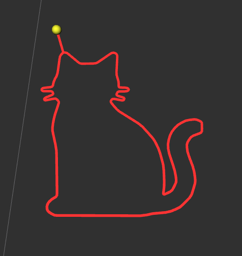
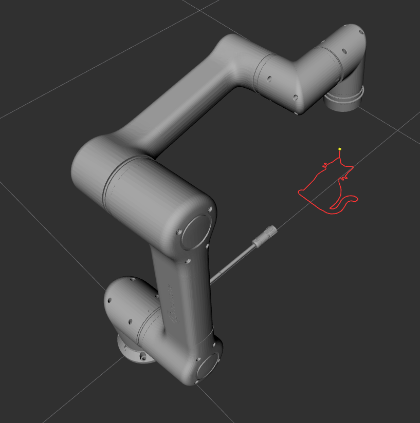

# 260809 작업 상세 — 기구학 정본 교정 · 비전 좌표 그리기

**작성 2026-08-09 (260809) · 브랜치 `ysh_moveit_ros2_control` · ysh (moveit2 모듈)**

요약본: [`260809_요약.md`](./260809_요약.md) · 실행법: [`260809_실행법.md`](./260809_실행법.md)

---

## 0. 한 줄

**로봇 모델이 실기와 43mm 어긋나 있던 것을 잡고, 그 위에서 비전이 뽑은 고양이 윤곽선을
mock 로봇으로 그려냈다.** 달성률 100%, 입력 도형 대비 편차 평균 0.064mm.

| | 결과 |
|---|---|
| 기구학 ↔ 실기 정합 | 43mm → **0.01mm** |
| 윤곽선 그리기 달성률 | **100.0%** (70점, 133×150mm) |
| 입력 대비 편차 (평균/최대) | **0.064 / 0.404 mm** |
| 평면 이탈 | **0.261 mm** |
| A4 크기 가능 여부 | ✅ 550mm 까지 100% |



*빨강 = `pen_trail` 이 기록한 실제 펜 끝 자취 · 노랑 구슬 = 현재 펜 끝 위치*

---

## 1. 기구학 정본 교정 — 43mm

### 1.1 무엇이 틀렸나

`hcr5_description` 의 URDF 는 물려받은 CAD 변환본(`hcr_robot.xacro`)에서 가져왔는데,
**그 CAD 치수가 실기와 달랐다.**

인천 팀이 2026-08-05 에 컨트롤러의 순기구학 RPC(`robot/convertPose`)로 6축을 20°씩
전 회전 스윕해(108 샘플, 원 적합 RMS 0.000mm) 실기 기구학을 추출하고, URDF 와
최소제곱 대조해 교정했다. 그 값을 이 브랜치에 이식했다.

| 관절 | 기존 (CAD) | **정본 (실측)** | 차이 |
|---|---|---|---|
| `joint_2.x` / `.z` | −0.0785 / 0.118778 | **−0.059138 / 0.119001** | +19.36 / +0.22 mm |
| `joint_3.x` / `.y` / `.z` | 0.000652 / 0.001 / 0.424 | **−0.019348 / 0 / 0.425001** | −20.00 / −1.00 / +1.00 mm |
| `joint_4.z` | 0.338567 | **0.338499** | −0.07 mm |
| `joint_5.z` | 0.089596 | **0.089504** | −0.09 mm |
| **`joint_6.x`** | **−0.089596** | **−0.132498** | **−42.90 mm ← 지배적** |

`joint_6.x` 하나가 전체 오차의 대부분이었다 — J5 축에서 flange 까지 거리가 실기는
132.5mm 인데 URDF 는 89.6mm 였다.

`joint_2.x` 와 `joint_3.x` 는 축이 평행해 겉보기엔 합만 의미 있을 것 같지만, 두 origin
사이에 J2 회전이 끼어 있어 실제로는 개별 식별된다(합만 맞추면 RMS 0.28mm 가 남는다).

**결과: 109개 자세 위치오차 RMS 43.4mm → 0.0060mm** (최대 0.0130mm).

### 1.2 왜 이것이 가장 위험한 종류의 버그인가

**에러가 나지 않는다.** 달성률 100%, TOTG 성공, 컨트롤러 SUCCESS — 전부 정상으로
보이고 **펜만 43mm 옆에 그린다.** A4 폭이 210mm 이므로 그림이 성립하지 않는다.

지금까지 문서 §7 에 정리한 문제들(가속도 한계 없음, 컨트롤러 인터페이스 빈 리스트)은
전부 "에러가 나서 알 수 있었던" 것이다. 이건 다르다.

### 1.3 관절 한계도 틀려 있었다

종전 문서에서 *"실기는 ±360°지만 넓힐 실익 없음"* 으로 유지했던 값들이 문제였다.

| 관절 | 기존 | 교정 | 이유 |
|---|---|---|---|
| joint_2 | ±90° | **±360°** | CAD 더미값 |
| joint_4 | ±170° | **±360°** | CAD 더미값 |
| **joint_5** | **±120°** | **±360°** | ⛔ **실기 wrist2 가 −267° 로 관측된다** |
| 전 관절 velocity | 3.1416 | 3.141593 | (정본과 표기 통일) |

**joint_5 가 결정적이다.** ±120° 로는 실기의 **현재 자세조차 URDF 로 표현할 수 없다** —
상태 브릿지(`hcr_bridge`)를 붙이는 순간 `/joint_states` 가 URDF 한계를 벗어나 깨진다.

### 1.4 mesh origin 도 함께 다시 계산했다

이 URDF 의 mesh visual/collision origin 은 **유도값**이다. CAD 가 링크들을 하나의
base 좌표계 자세로 그려 두었기 때문에, 각 링크의 origin 은 "영점 자세 누적변환의 역"
이어야 한다. 관절 origin 을 고쳤으니 이것도 같이 고쳐야 파일 내부 정합성이 유지된다.

⚠️ **그 결과 RViz 에서 `link5_1 ↔ link6_1` 사이에 약 43mm 의 틈이 보인다.**
이는 **실기 손목이 CAD 모델보다 그만큼 길다**는 뜻이고, **기구학은 옳다.**
STL 재작업은 별도 과제이고 계획·실행에는 영향이 없다.



*손목의 틈이 위 사진에서 보인다. 버그가 아니라 CAD 모델에 없는 실제 구조다.*

### 1.5 독립 검증 — 인천 수치를 그대로 믿지 않았다

이식한 값으로 **직접 순기구학을 다시 풀어** 실측과 대조했다.

| 검증 | 결과 |
|---|---|
| 홈 자세 FK flange (계산) | (490.00, −170.50, 441.50) mm |
| 홈 자세 flange (펜던트 실측) | (490.00, −170.50, 441.50) mm |
| **차이** | **0.01 mm** |
| 컨테이너 `tf2_echo base_link link6_1` | `[0.490, −0.171, 0.441]` ✅ |
| 컨테이너 `tf2_echo base_link pen_tip` | `[0.490, −0.171, 0.291]` = flange −150mm |

### 1.6 덤 — `flange_p = −π/2` 가 벤더 규약과 일치했다

홈 자세에서 `pen_tip` 의 TF 자세가 **RPY (180°, 0, 0)** 으로 나오는데, 펜던트가 같은
자세에서 보고한 flange **`rx = −180°`** 와 일치한다.

즉 기하 추론만으로 유도했던 `tool0` 프레임이 **실기 flange 프레임 규약과 같다.**
3단계에서 MoveIt 의 데카르트 자세를 실기 `program/plan` 웨이포인트로 넘길 때
**미지의 회전 보정이 끼지 않는다.**

> 다만 문서에 남은 각도는 `rx` 하나뿐이라 세 축 전부가 확정된 것은 아니다 —
> 실기에서 `mqtt_cmd.py pos` 로 세 각 모두 대조할 것.

### 1.7 재발 방지 — 가드 스크립트에 [F]·[G] 신설

`tools/ysh_check_moveit_config.py` 에 검사 2개를 추가했다.

```
[F] 기구학 정본   관절 origin 6개가 정본과 같은지
                  + 순기구학을 직접 풀어 홈 자세 flange 를 실측과 대조
[G] 홈 자세       SRDF group_state 'home' 이 실기 move/joint/home 자세인지
```

**[F] 가 가장 중요하다.** 다른 검사는 "에러가 나서 알 수 있는 것"을 앞당겨 잡지만,
기구학이 되돌아가면 아무 에러 없이 43mm 옆에 그린다. 그래서 값 대조에 그치지 않고
**FK 를 직접 풀어 실측 좌표와 대조**한다.

음성 테스트도 했다 — 값을 일부러 되돌리니 3건 검출 + `exit 1`, 고칠 값까지 출력.

### 1.8 SRDF 홈 자세 교체

종전 `group_state name="home"` 은 Setup Assistant 에서 임의로 잡은 자세였다.
실기가 `move/joint/home` 으로 실제 가는 자세로 교체했다.

```
실기 [0, −90, −90, −90, 90, 0]°  ──SIGN/DELTA──▶  URDF [90, 0, 90, 0, 90, 0]°
```

이 자세에서 펜이 정확히 바닥(−Z)을 향한다. **§2 의 그리기가 이 자세를 기준으로 한다.**

---

## 2. `05_draw_contour` — 비전 좌표를 그대로 그린다

### 2.1 이전 예제와 무엇이 다른가

| | 01~04 | **05** |
|---|---|---|
| 좌표 출처 | 우리가 만든 도형 | **비전이 이미지에서 뽑은 윤곽선** |
| 시작 자세 | 현재 자세 기준 상대 이동 | **SRDF home 으로 먼저 이동** (펜 수직) |
| 그리는 평면 | 임의 | **수평 XY 평면** (= 종이) |
| 결과 검증 | 달성률 숫자 | **입력 도형(초록) vs 실제 자취(빨강)** |

**이것이 프로젝트의 실제 작업 형태다.**

### 2.2 픽셀 → 로봇 좌표 변환 ★

입력은 OpenCV `findContours` 산출물이다 — 원점이 이미지 **좌상단**, v(세로)가
**아래로** 증가하는 픽셀 좌표.

로봇 베이스에 서서 +X 방향(바깥)을 보는 관찰자를 기준으로 잡는다.

```
관찰자의 "위쪽"(멀어지는 쪽) = +X     ← 이미지의 v 가 작은 쪽(위)
관찰자의 "왼쪽"              = +Y     ← 이미지의 u 가 작은 쪽(왼쪽)

    x = cx − (v − v_c) · s
    y = cy − (u − u_c) · s
```

**u 와 v 양쪽에 음부호가 붙는 것이 핵심이다.** 한쪽만 뒤집으면 거울상이 된다.

- 부호 하나는 **이미지 v 가 아래로 증가**하는 것을 보정
- 부호 하나는 **관찰자의 오른쪽이 −Y** 인 것을 보정

두 개가 함께 있어서 결과적으로 방향이 보존된다. 하나만 있으면 좌우가 뒤집힌다.

`s` 는 배율 [m/px]. bbox 의 긴 변이 `draw_size` 가 되도록 잡는다.
자세(orientation)는 home 의 것을 전 구간 유지 → **펜이 기울지 않는다.**

### 2.3 실행 단계를 나눈 이유

```
① SRDF home 으로 이동            펜이 −Z 를 향하는 자세 확보
② 픽셀 → 로봇 좌표 변환
③ 입력 도형을 초록 선으로 발행    /hcr5_examples/target_shape
④ 펜 든 채 시작점 위로 이동       ← 이 선이 자취에 남지 않게 그리기와 분리
⑤ /pen_trail/clear 호출          ← 자취에 "그린 것만" 남기려고
⑥ 하강 → 윤곽선 → 상승           한 번의 데카르트 경로
```

**④ 를 분리하지 않으면** 중심에서 시작점까지 가는 직선이 자취에 그대로 남아,
도형에 없는 선이 하나 더 그려진다.

**⑥ 을 한 번에 묶은 이유** — 수직 하강·상승은 위에서 내려다보면 점이라 자취에
군더더기를 남기지 않는다. 따로 쪼갤 이유가 없다.

**⑤ 는 서비스가 없으면 그냥 넘어간다.** 이 예제는 뷰어에 의존하지 않는다.

### 2.4 입력 도형 발행 — 2단계에 남겨 뒀던 것

2단계에서 *"입력 도형을 초록 선으로 겹쳐 편차를 눈으로 본다"* 를 다음 과제로 남겼는데,
이 예제가 그것을 채운다.

```cpp
m.type  = Marker::LINE_STRIP;
m.scale.x = 0.001;                       // LINE_STRIP 은 scale.x 만 쓴다
m.color = {0.1, 1.0, 0.1, 1.0};          // 초록
for (const auto& q : shape) m.points.push_back(q.position);
```

QoS 는 `transient_local` 이다 — **RViz 를 나중에 켜거나 토픽을 나중에 추가해도 보인다.**
(`pen_trail` 의 빨간 자취와 달리, 이건 한 번만 발행하고 노드가 죽기 때문에 필요하다)

### 2.5 좌표 교체 지점

지금 좌표는 `kContour` 에 박혀 있다(고양이 70점).

```cpp
static const std::vector<Px> kContour = { {56,0}, {47,12}, ... };
```

**vision 이 토픽/서비스로 넘겨주면 여기만 갈아끼우면 된다 — 나머지는 그대로다.**

---

## 3. 검증 결과 (mock, 2026-08-09)

### 3.1 실행 로그

```
엔드이펙터: pen_tip · 기준 프레임: base_link
홈 자세 도달
그리기 평면: z = 0.2915 m · 중심 (0.4900, -0.1705)
입력 도형: 70 점 · bbox 475×535 px → 133.2×150.0 mm (배율 0.00028 m/px)
입력 도형 발행: /hcr5_examples/target_shape (초록)
[이동] 실행 — 구간 24 개 · 2.3 초
이전 자취 삭제 (/pen_trail/clear)
[그리기] 실행 — 구간 195 개 · 19.3 초
──────── 결과 ────────
요청 웨이포인트 73 · 달성률 100.0% · 궤적 구간 195 · 소요 19.3 초
종료점 오차 0.01 mm
```

### 3.2 자취 대 입력 도형

`pen_trail` 이 기록한 자취(펜 다운 구간 249점)를 입력 도형 폴리라인과 대조했다.

| 항목 | 값 |
|---|---|
| 편차 평균 | **0.064 mm** |
| 편차 중앙 / 95% / 최대 | 0.040 / 0.211 / **0.404 mm** |
| **평면 이탈 (z 폭)** | **0.261 mm** |
| 자취 bbox | 150.0 × 133.0 mm |
| 입력 bbox | 150.0 × 133.2 mm |

### 3.3 ★ 이 편차는 로봇이 아니라 우리 파이프라인에서 나온다

**mock 하드웨어는 명령을 그대로 되돌려준다.** 즉 추종 오차가 0 이다.
그런데도 0.26mm 의 평면 이탈이 나온다. 어디서 오는가:

```
computeCartesianPath 가 eef_step(2mm) 간격으로 IK 를 푼다
        ↓
그 사이는 컨트롤러가 **관절 공간에서 선형 보간**한다
        ↓
관절 공간의 직선은 데카르트 공간에서 직선이 아니다 → 살짝 부푼다
        ↓
그 부풂이 평면 이탈 0.26mm · 면내 편차 최대 0.40mm 로 나타난다
```

**→ `eef_step` 을 줄이면 줄어든다.** 실기 선 품질 예산을 짤 때 이 값을 먼저 확보해야
한다. 로봇 반복정밀도가 ±0.1mm 이므로, 파이프라인 오차가 그보다 크면 로봇을 탓해도
소용이 없다.

또 하나 — TOTG 가 궤적점을 **병합**한다. 요청 웨이포인트 73개 → 2mm 보간으로 약 380
샘플이 나와야 하는데 최종 궤적은 195 구간이다. 이것도 해상도 바닥으로 작용한다.

### 3.4 크기 스윕 — A4 는 어디서 깨지나

`execute:=false` 로 계획만 돌려 확인했다.

| `draw_size` | 실제 크기 | 달성률 |
|---|---|---|
| 0.15 | 133 × 150 mm | 100.0% |
| 0.20 | 178 × 200 mm | 100.0% |
| 0.28 | 249 × 280 mm | 100.0% |
| 0.35 | 311 × 350 mm | 100.0% |
| 0.45 | 400 × 450 mm | 100.0% |
| 0.55 | 488 × 550 mm | 100.0% |

**A4(210×297)는 여유롭게 통과한다.** 홈 자세 기준 그리기 평면(z=291.5mm, 중심
x=490mm)이 작업반경 915mm 안쪽 한가운데라 550mm 까지도 IK 가 끊기지 않는다.

> 이건 **기구학적 도달 가능성**만 본 것이다. 실기에서는 관절 속도·가속도 한계와
> 특이점 근접이 먼저 한계가 될 가능성이 높다.

---

## 4. 부딪힌 문제와 해결 ★ 재현 시 중요

### 4.1 `demo.launch.py` 3중 실행 → `execute` 가 계속 abort

첫 실행에서 이렇게 죽었다.

```
[이동] 실행 — 구간 168 개 · 16.7 초
[ERROR] unknown goal response, ignoring...
[INFO]  Execute request aborted
[ERROR] MoveGroupInterface::execute() failed or timeout reached
```

게다가 **홈 자세 좌표가 이상했다** — `z = 0.4195 · 중심 (−0.1991, −0.6172)`.
계산으로는 `(0.490, −0.1705, 0.2915)` 여야 한다.

원인: `demo.launch.py` 가 **3개** 떠 있었다.

```
945~949  27분 전 (RViz 포함)   ← URDF 교정 **전**에 뜬 것 = 옛 43mm 모델을 들고 있음
1363~    2분 전               ← 테스트용
1705~    30초 전              ← 테스트용
```

`move_group` 이 3개면 액션 goal 이 엉뚱한 인스턴스로 가고, TF 도 서로 다른 모델에서
나온다. **`unknown goal response` 는 이 상황의 전형적인 증상이다.**

**교훈 2개:**
1. URDF 를 고쳤으면 **떠 있던 세션을 반드시 다시 띄워야 한다.** `robot_state_publisher`
   와 `move_group` 은 기동 시점에 모델을 읽고 그 뒤로 바꾸지 않는다.
2. 인스턴스 개수 확인은 `pgrep -x` 로. `ps | grep -c` 는 **자기 명령줄까지 세서 오진**한다
   (프로세스명이 15자를 넘으면 `pgrep -x` 가 안 먹으니 `pgrep -f` 를 쓴다).

```bash
pgrep -x move_group | wc -l          # 1 이어야 정상
```

정리 후 다시 돌리니 곧바로 100% 달성.

### 4.2 XML 주석 안에 `--` 를 쓸 수 없다

URDF 헤더에 설명을 넣으면서 밑줄을 `------` 로 그었더니:

```
XML parsing error: not well-formed (invalid token): line 8, column 4
```

**XML 주석 안에서 `--` 는 금지다.** `‾‾‾‾` 로 바꿔 해결.
`check_urdf` 가 아니라 **xacro 단계에서** 죽으므로 에러 메시지가 원인을 바로 가리키지
않는다.

### 4.3 `ros2 launch` 는 `--ros-args -p` 를 노드로 전달하지 않는다

처음엔 이렇게 안내했는데 **틀렸다.**

```bash
# ✗ 동작하지 않는다
ros2 launch hcr5_examples example.launch.py example:=draw_contour --ros-args -p draw_size:=0.25
```

노드 파라미터는 launch 파일이 명시적으로 실어 줘야 한다. 그리고 **타입을 붙여야 한다** —
`LaunchConfiguration` 은 문자열이라 그냥 넘기면 노드에 string 으로 선언되고,
`get_value<double>()` 이 예외를 던진다.

```python
from launch_ros.parameter_descriptions import ParameterValue
...
{name: ParameterValue(LaunchConfiguration(name), value_type=float) for ...}
```

```bash
# ✓ 이렇게
ros2 launch hcr5_examples example.launch.py example:=draw_contour draw_size:=0.25
```

### 4.4 `ros2 topic echo` 가 긴 배열을 잘라 버린다

자취를 수치로 검증하려고 `ros2 topic echo /pen_trail/trail --once` 를 떴는데
`points` 가 중간에 `'...'` 로 잘려 파싱이 깨졌다.

```bash
ros2 topic echo /pen_trail/trail --once --full-length     # ← 필수
```

(그리고 출력이 여러 YAML 문서라 파싱은 `yaml.safe_load_all` 을 써야 한다)

### 4.5 `pen_trail` 기본 필터가 세부를 뭉갠다

`min_point_distance` 기본값이 **2mm** 인데, 이 도형의 최단 변은 `draw_size=0.15` 에서
약 **1.2mm** 다. 기본값으로는 수염 같은 세부가 사라진다.

```bash
ros2 run hcr5_viz pen_trail --ros-args -p min_point_distance:=0.0002
```

> 그리고 자취 자체가 **30Hz 샘플링**이다. 19.3초 실행이면 최대 579 샘플 → 700mm 경로
> 기준 약 1.2mm 간격. **이것이 시각화의 해상도 한계이고, 로봇의 해상도가 아니다.**

---

## 5. 남은 것

### 5.1 이 작업에서 발견했지만 손대지 않은 것

**`hcr5.ros2_control.xacro` 의 `initial_value` 가 옛 임의 자세다.**

```xml
<param name="initial_value">1.5669</param>   <!-- joint_3 -->
<param name="initial_value">-1.59</param>    <!-- joint_4 -->
<param name="initial_value">-1.4695</param>  <!-- joint_5 -->
```

= 교체 전 SRDF `home` 값이다. **mock 이 실기가 절대 시작하지 않는 자세에서 출발한다**는
뜻이라, 3단계 mock ↔ 실기 대조 때 걸린다. 05 는 먼저 home 으로 가니 무관하지만
고쳐두는 게 맞다. 별건이라 이번엔 손대지 않았다.

**`link6_1` STL 이 43mm 짧다** (§1.4). 시각화만의 문제이고 계획·실행에는 무영향.

### 5.2 다음 단계 — 3단계 궤적 실행 층 (T15)

인천 08-05 성과로 실기 프로토콜은 전부 확보됐다. `HANDOFF_260805_ros2_bridge.md` 기준
**미착수는 궤적 실행 층 하나**이고, 그것이 moveit2 모듈 담당 범위와 겹친다.

| # | 할 일 | 로봇 필요? |
|---|---|---|
| 1 | 궤적 → `program/plan` 변환기 (MQTT 없는 순수 함수, `--dry-run` 으로 바이트 수 출력) | ❌ |
| 2 | `FollowJointTrajectory` 액션 서버 (1차 목표: 받고·변환하고·출력하고 **거절**) | ❌ |
| 3 | 실기 단발 검증 — `move/joint/here` + 3중 가드 | ✅ |
| 4 | 스트로크 — 직선 1개 → 사각형 → **이 고양이** | ✅ |

**05 가 4단계의 입력이 된다.** 그리고 계측기(`pen_trail` + 초록 입력 도형)도
실기에서 수정 없이 그대로 돈다 — 상태 브릿지가 `/joint_states` 를 쏘면
`robot_state_publisher` 가 TF 를 만들고, `pen_trail` 은 TF 만 읽기 때문이다.

---

## 6. 이 작업의 산출물

| 파일 | 내용 |
|---|---|
| `hcr5_description/urdf/hcr5_arm.xacro` | 관절 origin·한계 정본화 (§1) |
| `hcr5_moveit_config/config/hcr5.srdf` | `home` 을 실기 자세로 (§1.8) |
| `tools/ysh_check_moveit_config.py` | 검사 [F]·[G] 신설 (§1.7) |
| `hcr5_examples/src/05_draw_contour.cpp` | ★ 윤곽선 그리기 (§2) |
| `hcr5_examples/launch/example.launch.py` | 파라미터 인자화 (§4.3) |
| `frist_pic.png` · `frist_pic_all.png` | RViz 결과 화면 |
| `frist_pic_control_cam.webm` | 실행 영상 |

**커밋**

```
1aafff0  chore(urdf): hcr5_arm.xacro 줄바꿈 CRLF → LF 정규화
cc4879f  fix(urdf): 기구학 정본 교정 — 실기와 43mm 어긋나 있었다
8dab318  feat(examples): 05_draw_contour — 비전 좌표를 그대로 그리는 예제
```

> `1aafff0` 은 줄바꿈만이라 리뷰 시 건너뛰어도 된다. CAD 변환본이 CRLF 를 물려받아서
> 편집하니 diff 가 462줄로 부풀었고, 실제 변경(85줄)이 묻히지 않게 분리했다.

---

## 7. 함께 볼 문서

| 무엇 | 어디 |
|---|---|
| 이 작업 요약 | [`260809_요약.md`](./260809_요약.md) |
| 실행 명령어 | [`260809_실행법.md`](./260809_실행법.md) |
| 워크스페이스 전체 정리 | [`README.md`](./README.md) |
| 설계 근거·의사결정 경위 | [`../../../docs/ysh_HCR5_ros2_control_구축_상세.md`](../../../docs/ysh_HCR5_ros2_control_구축_상세.md) |
| 코드 한 줄씩 해설 | [`../../../ysh_debug/`](../../../ysh_debug/) |
| 실기 MQTT 프로토콜 | `origin/markch/hcr5_ros2` — `src/drivers/hcr_comm/README.md` |
| 실기 브릿지 인수인계 | `origin/markch/hcr5_ros2` — `HANDOFF_260805_ros2_bridge.md` |
