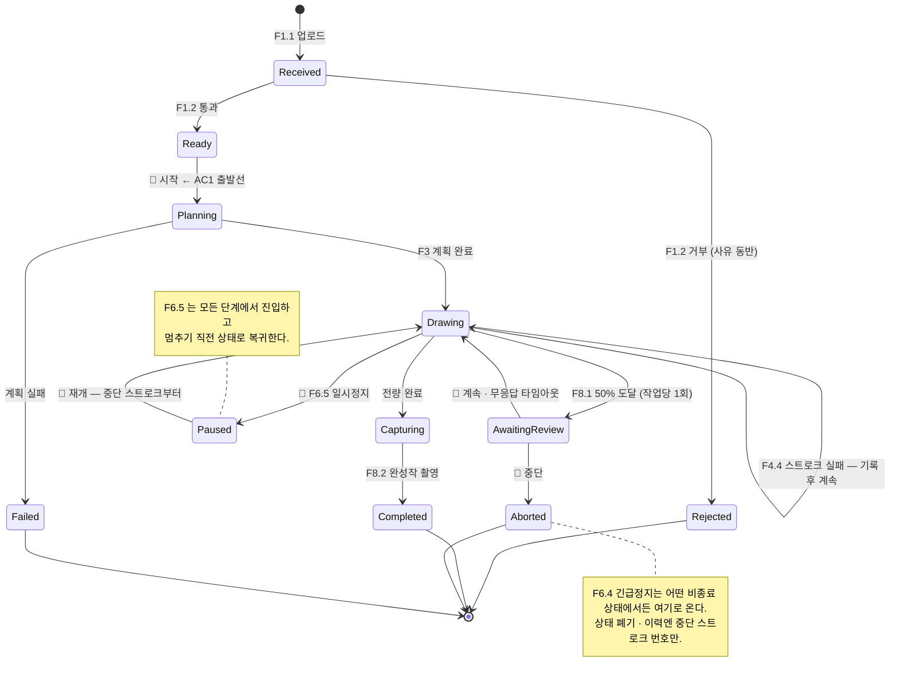

# operator

**⑥ 작업 관리의 스켈레톤이 서 있는 상태.** 작업 1건의 생애주기·상태 전이·이력 레코드
형식이 확정됐고, 시나리오 9종으로 관통 검증됐다. 웹(React + Node.js)은 자리만
잡혀 있고 코드는 없다.

## 이 모듈은 두 덩어리다

문서가 `operator` 에 배정한 것은 성격이 다른 둘이다. 뒤엉키기 쉬우니 먼저 갈라 둔다.

| 덩어리 | 하는 일 | 사는 곳 | MVP |
|---|---|---|---|
| **⑥ 작업 관리** | 작업 상태 소유 · 긴급정지 · 일시정지 · 진행률 | `ws_operator/` (C++ ROS 노드) | **코어**(긴급정지 최소) |
| **창구** | 업로드 UI · 모니터링 화면 · 이력 조회·저장 | `backend/` · `frontend/` (Node.js · React) | 이후 |

**"어디까지 그렸는가"를 소유하는 것은 앞의 것이다.** `Process Flow.md` §3.4 가 미결로
남겨둔 "상태 소유자(③ 로봇제어 / ⑥ 작업관리 경계)" 질문의 답이며, F6.5 일시정지가
성립하려면 누군가는 이 상태를 들고 있어야 한다. 웹은 그 상태를 **보여줄 뿐 소유하지
않는다** — 두 곳이 상태를 들면 반드시 어긋난다.

## 사용자가 하려는 것

BRD·Process Flow 에서 도출한 다섯 가지. 이것이 그대로 화면이 되고, 상태 머신의 간선이 된다.

1. **그림 한 장 그리게 하기** — 이미지 올림 → (거부되면 사유 보고 다시) → 진행 지켜봄 → 결과 받음
2. **중간에 계속할지 판단** (F8.1) — 50% 지점 차이 정보를 보고 계속/중단
3. **즉시 멈춤** (F6.4) — 상태 **폐기**, 재개 없음
4. **잠깐 멈췄다 이어감** (F6.5) — 상태 **보존**, 중단 스트로크부터
5. **지난 작업 돌아보기** (F6.3) — 입력·계획·결과·소요시간, 중단 시 스트로크 번호

## 경계 — 무엇을 받고 무엇을 내는가

| 방향 | 내용 |
|---|---|
| **사람 →** | 이미지 파일 · 시작 · 계속/중단 결정 · 긴급정지 · 일시정지 · 재개 · 이력 조회 |
| **파이프라인 →** | 적합성 판정(F1.2) · 계획 요약(스트로크 수 · 선길이 · **F3.3 최적화 전후 이동시간**) · 스트로크 완료/실패 · 차이 정보(F8.1) · 완성작 이미지(F8.2) · 완료 통지 |
| **→ 사람** | 현재 상태·진행률 · 거부 사유 · 차이 정보 · 결과 이미지 · 이력 |
| **→ 파이프라인** | 작업 지시(이미지 경로 + 작업 ID) · 정지/일시정지/재개/계속 명령 |
| **→ 저장소** | 작업 레코드(JSON → Node → SQLite) · 파일(입력 이미지 · 완성작 사진) |

---

## 작업 1건의 생애주기 — 확정

**이 모듈의 알맹이다.** F6.2(모니터링)가 보여주는 것, F6.3(이력)이 저장하는 것,
F6.4·F6.5 가 가르는 것이 전부 이 한 물건의 다른 면이다.



- `capture_enabled=false` 면 `Drawing → Completed` 로 직행한다 — MuJoCo 에는 카메라가
  없어(PF §5.1) sim 완주에서는 F8 을 끈다.
- **`Ready` 를 따로 둔 이유** — AC1 은 "종이가 틀에 놓인 상태에서 시작"부터 잰다.
  검사 통과와 작화 시작 사이에 사람이 종이를 놓는 순간이 있고, 그 지점이 측정 시작선이다.
- **`AwaitingReview` 는 N2 예산을 먹는다** — 사람이 안 보면 로봇이 서 있다. 그래서
  타임아웃이 정책에 있다 (아래 미결 참조).

## 인터페이스 — 확정

**이 절이 형식의 원본이다** — 헤더 주석과 이 문서가 어긋나면 헤더가 맞다고 보고 이 문서를 고친다.

### 경계 타입 — `atlier/job/job.hpp`

**ROS·웹·DB 어디에도 의존하지 않는다.** 작업을 소비하는 쪽(웹 백엔드, 이력 저장소)이
이 헤더에 대응하는 형식만 알면 되게 하기 위함이다. 의존을 늘리지 말 것.

> 네임스페이스가 `atlier::operator` 가 아닌 이유 — **`operator` 는 C++ 예약어다.**
> 디렉터리는 `src/operator`(SA 의 모듈명)지만 코드상 이름은 `atlier::job` 을 쓴다.

```cpp
namespace atlier::job {

enum class State { Received, Ready, Rejected, Planning, Drawing,
                   AwaitingReview, Paused, Capturing, Completed, Aborted, Failed };
enum class Command { Start, EmergencyStop, Pause, Resume, ReviewContinue, ReviewAbort };
enum class Event { InputAccepted, InputRejected, PlanReady, PlanFailed,
                   StrokeDone, StrokeFailed, ReviewTimeout, DrawingDone, CaptureDone };

struct Intervention { double at_s; int at_stroke; Command command; };  // AC1 증거
struct PlanSummary  { int stroke_count; double draw_len_mm,
                      travel_before_s, travel_after_s; };              // F3.3 → AC2

struct Record {                       // = BRD F6.3 이 저장할 대상의 원형
  std::string id;  State state;
  std::string input_image_path, reject_reason;
  PlanSummary plan;
  int strokes_done;  std::vector<int> failed_strokes;  int aborted_at_stroke;
  double started_at_s, ended_at_s;                     // N2 측정
  std::vector<Intervention> interventions;             // AC1 판정
  std::string result_image_path, quality_verdict;      // F8.2 · AC3
};

// 수락 기준을 코드가 직접 답한다
bool   WasUnattended(const Record &);                       // AC1
double OptimizationGainRatio(const PlanSummary &);          // AC2
bool   MeetsAc2(const PlanSummary &, double th = 0.20);
bool   MeetsN2(const Record &, double budget_s = 900.0);    // N2
}
```

### 정책 — `atlier/job/policy.hpp`

| 필드 | 기본값 | 근거 |
|---|---|---|
| `review_enabled` | true | F8.1. **MVP 는 false** — SA 가 ⑤를 `이후`로 둠 |
| `review_at_ratio` | 0.5 | F8.1 — 전체의 약 50% 지점, 작업당 1회 |
| **`review_timeout_s`** | **60.0** | ⚠️ **문서에 근거가 없는 유일한 신규 값** — 아래 미결 참조 |
| `review_default_continue` | true | 무응답 = 자동 계속 (AC1 해석 ①) |
| `capture_enabled` | true | F8.2. MuJoCo 에는 카메라가 없어 sim 에서는 false |
| `stroke_retry_count` | 0 | F4.4 — Phase 1 은 재시도 없음. 자리만 (아직 미사용) |
| `pen_up_on_pause` | true | PF §3.4 — 펜이 닿은 채 서면 blob 이 남는다 |
| `pen_up_on_estop` | false | PF §3.4 — 폐기하므로 blob 무관, N4 는 즉시를 요구 |

### 상태 머신 — `atlier/job/job_machine.hpp`

```cpp
class Machine {
  explicit Machine(std::string job_id, Policy policy = {});

  Transition Apply(Command, double now_s);              // 사람 명령
  Transition InputAccepted(double now_s);               // 파이프라인 사실
  Transition InputRejected(const std::string & reason, double now_s);
  Transition PlanReady(const PlanSummary &, double now_s);
  Transition PlanFailed(const std::string & reason, double now_s);
  Transition StrokeDone(double now_s);                  // F8.1 지점 판정도 여기서
  Transition StrokeFailed(int stroke_index, double now_s);
  Transition DrawingDone(double now_s);
  Transition CaptureDone(const std::string & image_path, double now_s);
  Transition Tick(double now_s);                        // 확인 타임아웃 판정

  const Record & record() const;   State state() const;
  const std::vector<Transition> & history() const;
};
```

**시간은 밖에서 넣는다(`now_s`).** 시계를 들고 있으면 ROS 시간·시뮬 시간·테스트 시간을
갈아끼울 수 없고, CLI 하네스가 15분짜리 작업을 순식간에 재생하지도 못한다.

### 규약

- **동시 작업은 1건.** BRD 부록 B 가 다중 작업 큐를 Phase 3 으로 미뤘으므로 큐·스케줄러가
  없다. 이 전제가 깨지면 상태 머신부터 다시 봐야 한다
- **거절도 이력에 남는다** — "그 상태에서 그 명령이 왜 안 먹었는지"가 운영 화면과 사후
  분석 양쪽에서 필요하다. 단 `Tick` 의 거절은 남기지 않는다(주기적으로 돌기 때문)
- **스트로크 진행은 이력에 남기지 않는다** — 300~500 개를 전부 남기면 이력이 진행률
  로그로 파묻힌다. 진행률은 `Record::strokes_done` 으로 본다
- **저장하지 않는다** — 직렬화(`job_json.hpp`)까지만이다. SQLite 에 넣는 일은 rosbridge 를
  구독하는 Node 백엔드가 한다 (SA §5.2 "DB 에 직접 붙는 것은 하나")
- **경계 전달 형식(토픽/서비스/메시지 타입)은 아직 정하지 않았다** — vision↔moveit2
  경계와 함께 정해야 한다. 코어를 ROS 무관 라이브러리로 분리해 둔 이유가 그 결정을
  늦출 수 있어서다

---

## 운영 계층이 만드는 증거

이 모듈은 창구인 동시에 **세 수락 기준의 증거가 만들어지는 유일한 자리**다.

| 기준 | 증거 | 어디서 |
|---|---|---|
| **AC1** 사람 개입 없이 완주 | 개입 이벤트 로그가 비어 있음 + 완주 기록 | `Record::interventions` → `WasUnattended()` |
| **AC2** 무최적화 대비 20% 단축 | F3.3 이 올려보낸 최적화 전/후 이동시간 | `PlanSummary` → `OptimizationGainRatio()` |
| **N2** 1장 15분 이내 | 시작·종료 타임스탬프 | `started_at_s`·`ended_at_s` → `MeetsN2()` |

> **AC1 개입 로그는 BRD 에 없던 것을 더한 것이다.** F6.3 의 저장 항목(입력·계획·결과·
> 소요시간)만으로는 "사람이 손댔는지"를 사후에 알 수 없어 AC1 을 로그로 판정할 근거가
> 없었다. `Command::Start` 는 AC1 의 출발선 자체라 개입으로 세지 않는다.

판정 결과는 `job.json` 의 `acceptance` 에 실려 나간다 — **판정 규칙을 웹 쪽에서 다시
구현하지 말 것.** 두 언어에 중복되면 반드시 어긋난다.

## F1.2 는 누가 하는가 — 결정 (2026-07-27)

**vision(C++)이 한다.** `operator` 는 판정을 요청하고 결과를 받을 뿐 픽셀을 보지 않는다.

Process Flow §2.1 은 적합성 검사를 운영 레인에 그렸지만, "흰 배경 라인아트냐"는 픽셀을
봐야 판정된다. 판정을 픽셀 아는 쪽에 두는 편이 자연스럽고 N1(제품 코드 C++)과도 맞는다.
업로드 검사에 모듈 경계를 한 번 건너는 비용은 감수한다.

→ vision 쪽에 검사 함수가 필요하다. `src/vision/README.md`에 **기능 E**로 신설했다
(vision 문서 변경이라 별도 커밋 — 이 브랜치에는 없다).

---

## 구성

```
operator/
├── README.md            # (이 파일) 인터페이스 원본 + 세팅 절차
├── Dockerfile           # ROS 2 Jazzy ros-base + rosbridge — 세 환경 중 가장 가볍다
├── compose.yml          # 실행 정의 (GPU·X11 없음 — 창을 띄우지 않는다)
├── entrypoint.sh
├── run_container.sh     # 헬퍼 (build/up/shell/down/logs/config)
├── data/                # ⛔ git 제외 — CLI 산출물, 나중에 uploads/·results/·atlier.db
├── backend/             # 자리만 — Node.js (업로드·SQLite 이력·정적 서빙)
├── frontend/            # 자리만 — React + roslibjs
└── ws_operator/src/
    ├── job_core/        # ROS 무관 C++ 라이브러리 + 확인용 CLI
    └── job_manager/     # rclcpp 래퍼 (경계 인터페이스 미정)
```

**2층으로 나눈 이유** — vision 과 같다. 코어가 ROS 를 모르면 ROS 없이 상태 전이를 검증할
수 있고, 경계 전달 형식을 나중에 정할 수 있으며, 소비자는 타입 헤더 하나만 알면 된다.
`job_core` 에 `rclcpp` 를 붙이지 말 것.

**웹을 별도 컨테이너로 두는 이유** — ROS 이미지에 Node 런타임을 끌어들이면 두 스택의
빌드 캐시가 서로를 무효화한다. 자리는 `compose.yml` 하단에 주석으로 잡아 두었다.

## 1. 이미지 빌드 (최초 1회)

```bash
cd src/operator
./run_container.sh build      # 3~8분 (ros-base + rosbridge)
```

전제 조건(Docker·Compose v2·docker 그룹 등)은 `src/moveit2/README.md` §0과 같다.

> **GPU 설정이 없는 것은 의도된 것이다.** moveit2·vision 에 있는 `compose.override.yml`
> 훅이 여기엔 없다 — 그 훅은 PC별 GPU 설정을 위한 것이고, 이 컨테이너는 창을 띄우지
> 않는다. 화면은 브라우저가 그리고 확인 산출물은 파일로 떨어진다.

## 2. 빌드와 실행

```bash
./run_container.sh shell           # 컨테이너 진입
colcon build --symlink-install     # 워크스페이스 루트가 기본 작업 디렉터리
source install/setup.bash
```

### 확인 — `job_cli`

**이 도구가 있는 이유는 상태 머신이 맞게 도는지 눈으로 보기 위해서다.** 로봇도 웹도
없이, 가짜 파이프라인이 스트로크를 흉내내며 작업 하나를 관통시킨다.

```bash
# 시나리오 9종 전부 — 상태 머신의 모든 간선을 한 번씩 밟는다
ros2 run job_core job_cli --scenario all --out-dir ~/data/out

# 하나만
ros2 run job_core job_cli --scenario estop --strokes 20
```

| 시나리오 | 무엇을 보여주나 |
|---|---|
| `happy` | MVP 설정(F8 끔) 정상 완주 — **AC1 ○** |
| `reject` | F1.2 거부. 로봇은 한 번도 움직이지 않는다 (PF §3.1) |
| `plan-fail` | 계획 실패 — 지금 vision F2.1~F2.3 이 비어 있어 실제로 나올 수 있는 경로 |
| `estop` | 작화 중 F6.4 긴급정지 → 폐기. 뒤이은 재개 시도가 **거절**되는 것까지 |
| `pause` | F6.5 일시정지 → 재개 → 완주 (개입 2회) |
| `review-continue` | 50% 확인에서 사람이 "계속" → 완주하되 **개입 1회로 AC1 ✗** |
| `review-abort` | 50% 확인에서 사람이 "중단" |
| `timeout` | 확인 무응답 → 자동 계속 → 완주. **개입 0회로 AC1 ○** (해석 ①) |
| `stroke-fail` | F4.4 — 실패 2건 기록하고 계속, 완주 |

> `review-continue` 와 `timeout` 을 나란히 보면 아래 미결(AC1 vs F8.1)의 두 갈래가
> 그대로 드러난다 — 같은 완주인데 하나는 AC1 불합격이다.

| 출력 | 내용 |
|---|---|
| stdout | 전이 타임라인 + 요약(진행·실패·개입·수락기준 판정) |
| `<name>.job.json` | **F6.3 레코드 원형** — Node 백엔드가 DB 한 행으로 옮길 대상 |
| `<name>.timeline.md` | **주력.** mermaid 상태도 — 실제로 밟은 경로만. GitHub·브라우저에서 바로 보인다 |
| `<name>.timeline.csv` | `seq,at_s,accepted,from,to,label,note` — 거절된 시도까지 |

`data/` 가 호스트에 마운트되어 있어 컨테이너 밖에서 바로 열면 된다. 전체 옵션은 `--help`.

### ROS 노드

```bash
ros2 run job_manager job_manager --ros-args \
  --params-file install/job_manager/share/job_manager/config/job_params.yaml
```

경계 인터페이스가 미정이라 이 노드는 아직 토픽·서비스를 열지 않는다. 정책 적재와
코어 링크가 살아 있는지 확인하는 용도다(기동 시 짧은 작업 하나를 관통시킨다).

**열릴 경계의 방향은 정해졌다** (SA §5.2 재확정):

```
React + roslibjs ──ws:9090── rosbridge ── job_manager ──(액션)──→ MoveIt2
Node.js ──HTTP── 업로드 파일 저장 · SQLite 이력 · 정적 서빙
```

웹이 부르는 것은 이 노드의 **서비스·토픽뿐**이다. rosbridge 는 액션을 지원하지
않으므로(SA §5.3) MoveIt2 액션 호출은 이 노드가 서버측에서 한다 — **job_manager 를 두면서
"rosbridge 액션 미지원" 제약이 저절로 해소됐다.**

---

## 구현 상태

| 항목 | 상태 |
|---|---|
| 작업 생애주기·상태 전이 (`job_machine`) | ✅ 구현됨 — 시나리오 9종 관통 |
| 레코드·수락기준 판정 (`job.hpp`) | ✅ 구현됨 |
| 직렬화 (`job_json`) | ✅ 구현됨 — 외부 JSON 라이브러리 없이 |
| 확인 하네스 (`job_cli` · 타임라인·CSV·mermaid) | ✅ 구현됨 |
| ROS 래퍼 (`job_manager`) | 🟨 정책 적재·자기 점검만 — **토픽/서비스 미정** |
| 파이프라인 연동 (vision·moveit2) | ⬜ 경계 형식 미정 |
| 웹 백엔드 (Node.js · SQLite) | ⬜ 자리만 (`backend/README.md`) |
| 웹 프론트 (React · roslibjs) | ⬜ 자리만 (`frontend/README.md`) |
| AC3 채점기 (CLIP) 연동 | ⬜ 미착수 |

**검증된 것 (2026-07-27)**: 시나리오 9종 관통 — 상태 머신의 모든 간선을 한 번씩 밟음.
시간 검산 일치(`happy` 27s = 계획 3 + 12×2 · `pause` 65s · `timeout` 96s),
`estop` 중단 스트로크 4/12 기록, `stroke-fail` 실패 2건(2,7) 기록 후 완주,
거절 경로(종료된 작업에 명령)까지 이력에 남음. 산출물 27개(9종 × 3형식).
`job_manager` 노드는 파라미터 적재 → 자기 점검 → F8.1 대기까지 동작.

## 미결

- **`review_timeout_s` 값과 AC1 문구** — 무응답 자동 계속(해석 ①)을 기본값 60초로
  구현했으나, BRD AC1 문구 조정이 필요할 수 있다. 업무목록 "AC1 과 F8.1 양립 해석" 참조.
  `review-continue` 와 `timeout` 시나리오를 나란히 돌리면 쟁점이 그대로 보인다
- **경계 전달 형식(토픽/서비스/메시지 타입)** — vision↔moveit2 경계와 함께 정한다
- **BRD N1 문구** — 제품 코드가 C++(파이프라인) · JavaScript(운영 웹) · Python(AC3 채점기)
  셋이 됐다. "전 구간 C++"과 G1 판정 기준이 실제와 어긋난다
- **`stroke_retry_count`** — 자리만 있고 상태 머신이 아직 쓰지 않는다 (Phase 1 은 재시도 없음)
- **티칭펜던트 UI** — 이전 README 에 있었으나 BRD·SA·PF 어디에도 근거가 없어 뺐다.
  필요하면 F8 처럼 BRD 역반영이 먼저다

## 설계 참조

| 문서 | 경로 |
|---|---|
| 시스템 구조 | `docs/System Architecture.md` — §4 구성 블록(⑥), §5.1 기술 스택, §5.2 웹↔ROS2 연동 |
| 요구사항 | `docs/Business Requirements.md` — F1 · F6 · F8, AC1~AC3 |
| 처리 흐름 | `docs/Process Flow.md` — §2.2 판단 지점, §3.3·§3.4 정지 둘의 대비, §6 AC1 개입 검토 |
| 경계 상대편 | `src/vision/README.md`(F1.2·F2·F8 정보) · `src/moveit2/README.md`(F3·F4 진행·완료) |
